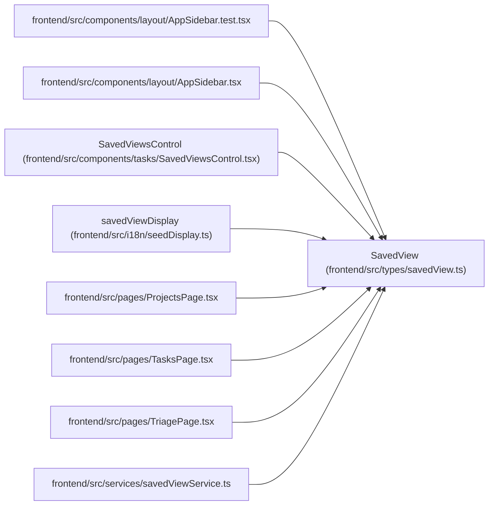

# SavedView

**Location:** `frontend/src/types/savedView.ts:4`
**Kind:** Class
**Bases:** —
**Module:** [savedView](../modules/savedView.md)

## Description

_Auto-generated from `SavedView` in `frontend/src/types/savedView.ts`._

## Attributes

| Name | Type | Default | Description |
|------|------|---------|-------------|
| `id` | `number` | *required* | — |
| `name` | `string` | *required* | — |
| `description` | `string \| null` | *required* | — |
| `seed_key` | `string \| null` | *required* | — |
| `view_type` | `SavedViewType` | *required* | — |
| `scope` | `SavedViewScope` | *required* | — |
| `filters_json` | `Record<string, unknown>` | *required* | — |
| `sort_json` | `Record<string, unknown>` | *required* | — |
| `columns_json` | `Record<string, unknown>` | *required* | — |
| `created_by_session_id` | `number \| null` | *required* | — |
| `schema_version` | `number` | *required* | — |
| `metric_migration_note` | `string \| null` | *required* | — |
| `owner_principal_id` | `number \| null` | *required* | — |
| `is_valid` | `boolean` | *required* | — |
| `invalid_reason` | `string \| null` | *required* | — |
| `created_at` | `string` | *required* | — |
| `updated_at` | `string` | *required* | — |

## Methods

*No public methods. Inherits from base classes.*

## Relationships

<!-- Auto-generated relationship summary. Do not edit by hand. -->

### Summary

| Module | Methods | Attributes |
|---|---:|---|
| [savedView](../modules/savedView.md) | 0 | `columns_json`, `created_at`, `created_by_session_id`, `description`, `filters_json`, `id`, `invalid_reason`, `is_valid`, `metric_migration_note`, `name`, `owner_principal_id`, `schema_version` |

### References

| Reference | Kind | Source | Call sites |
|---|---|---|---:|
| `AppSidebar.test` | import | [AppSidebar.test](../modules/AppSidebar.test.md) | — |
| `AppSidebar` | import | [AppSidebar](../modules/AppSidebar.md) | — |
| `SavedViewsControl` | type_reference | [SavedViewsControl](../modules/SavedViewsControl.md) | — |
| `savedViewDisplay` | type_reference | [seedDisplay](../modules/seedDisplay.md) | — |
| `ProjectsPage` | import | [ProjectsPage](../modules/ProjectsPage.md) | — |
| `TasksPage` | import | [TasksPage](../modules/TasksPage.md) | — |
| `TriagePage` | import | [TriagePage](../modules/TriagePage.md) | — |
| `savedViewService` | import | [savedViewService](../modules/savedViewService.md) | — |
