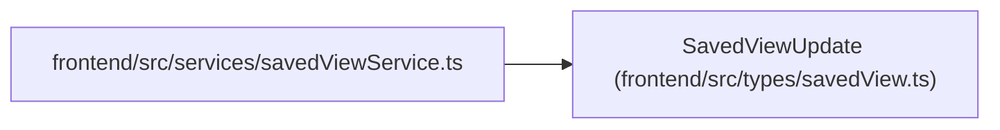

# SavedViewUpdate

**Location:** `frontend/src/types/savedView.ts:52`
**Kind:** Class
**Bases:** —
**Module:** [savedView](../modules/savedView.md)

## Description

_Auto-generated from `SavedViewUpdate` in `frontend/src/types/savedView.ts`._

## Attributes

| Name | Type | Required | Default | Description |
|------|------|----------|---------|-------------|
| `name` | `string` | No | — | — |
| `description` | `string \| null` | No | — | — |
| `view_type` | `SavedViewType` | No | — | — |
| `scope` | `Exclude<SavedViewScope, 'system'>` | No | — | — |
| `filters_json` | `Record<string, unknown>` | No | — | — |
| `sort_json` | `Record<string, unknown>` | No | — | — |
| `columns_json` | `Record<string, unknown>` | No | — | — |
| `schema_version` | `number` | No | — | — |

## Methods

*No public methods. Inherits from base classes.*

## Relationships

<!-- Auto-generated relationship summary. Do not edit by hand. -->

### Summary

| Module | Methods | Attributes |
|---|---:|---|
| [savedView](../modules/savedView.md) | 0 | `columns_json`, `description`, `filters_json`, `name`, `schema_version`, `scope`, `sort_json`, `view_type` |

### References

| Reference | Kind | Source | Call sites |
|---|---|---|---:|
| `savedViewService` | import | [savedViewService](../modules/savedViewService.md) | — |
