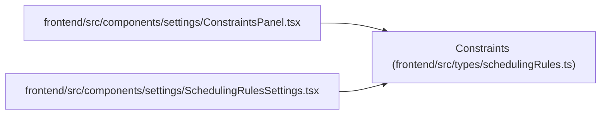

# Constraints

**Location:** `frontend/src/types/schedulingRules.ts:37`
**Kind:** Class
**Bases:** —
**Module:** [schedulingRules](../modules/schedulingRules.md)

## Description

_Auto-generated from `Constraints` in `frontend/src/types/schedulingRules.ts`._

## Attributes

| Name | Type | Required | Default | Description |
|------|------|----------|---------|-------------|
| `sequential_per_assignee` | `boolean` | Yes | — | — |
| `respect_dependencies` | `boolean` | Yes | — | — |
| `min_start_date` | `boolean` | Yes | — | — |
| `max_finish_date` | `boolean` | Yes | — | — |
| `prefer_uninterrupted` | `boolean` | Yes | — | — |
| `balance_workload` | `BalanceWorkload \| null` | No | — | — |

## Methods

*No public methods. Inherits from base classes.*

## Relationships

<!-- Auto-generated relationship summary. Do not edit by hand. -->

### Summary

| Module | Methods | Attributes |
|---|---:|---|
| [schedulingRules](../modules/schedulingRules.md) | 0 | `balance_workload`, `max_finish_date`, `min_start_date`, `prefer_uninterrupted`, `respect_dependencies`, `sequential_per_assignee` |

### References

| Reference | Kind | Source | Call sites |
|---|---|---|---:|
| `ConstraintsPanel` | import | [ConstraintsPanel](../modules/ConstraintsPanel.md) | — |
| `SchedulingRulesSettings` | import | [SchedulingRulesSettings](../modules/SchedulingRulesSettings.md) | — |
