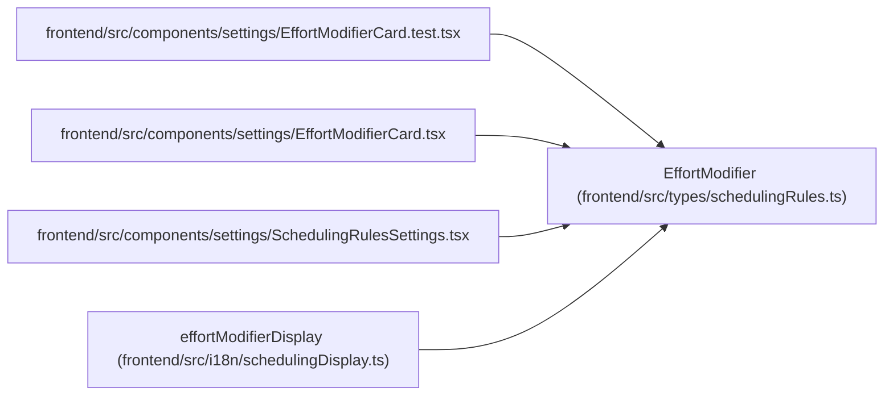

# EffortModifier

**Location:** `frontend/src/types/schedulingRules.ts:23`
**Kind:** Class
**Bases:** —
**Module:** [schedulingRules](../modules/schedulingRules.md)

## Description

_Auto-generated from `EffortModifier` in `frontend/src/types/schedulingRules.ts`._

## Attributes

| Name | Type | Default | Description |
|------|------|---------|-------------|
| `id` | `string` | *required* | — |
| `enabled` | `boolean` | *required* | — |
| `formula` | `string \| null` | *required* | — |
| `operation` | `'ceil' \| 'floor' \| 'round' \| null` | *required* | — |
| `fallback` | `string` | *required* | — |
| `min_value` | `number \| null` | *required* | — |

## Methods

*No public methods. Inherits from base classes.*

## Relationships

<!-- Auto-generated relationship summary. Do not edit by hand. -->

### Summary

| Module | Methods | Attributes |
|---|---:|---|
| [schedulingRules](../modules/schedulingRules.md) | 0 | `enabled`, `fallback`, `formula`, `id`, `min_value`, `operation` |

### References

| Reference | Kind | Source | Call sites |
|---|---|---|---:|
| `EffortModifierCard.test` | import | [EffortModifierCard.test](../modules/EffortModifierCard.test.md) | — |
| `EffortModifierCard` | import | [EffortModifierCard](../modules/EffortModifierCard.md) | — |
| `SchedulingRulesSettings` | import | [SchedulingRulesSettings](../modules/SchedulingRulesSettings.md) | — |
| `effortModifierDisplay` | type_reference | [schedulingDisplay](../modules/schedulingDisplay.md) | — |
