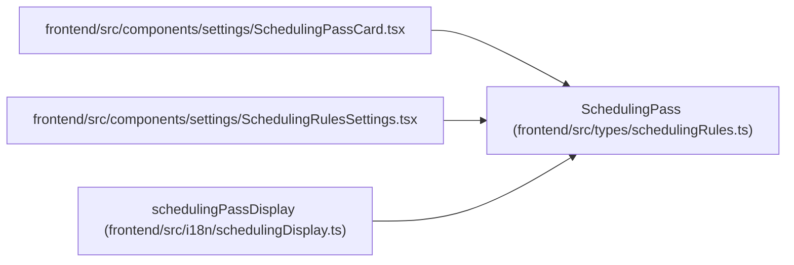

# SchedulingPass

**Location:** `frontend/src/types/schedulingRules.ts:15`
**Kind:** Class
**Bases:** —
**Module:** [schedulingRules](../modules/schedulingRules.md)

## Description

_Auto-generated from `SchedulingPass` in `frontend/src/types/schedulingRules.ts`._

## Attributes

| Name | Type | Default | Description |
|------|------|---------|-------------|
| `id` | `string` | *required* | — |
| `description` | `string` | *required* | — |
| `enabled` | `boolean` | *required* | — |
| `filter` | `FilterConfig` | *required* | — |
| `sort` | `SortCriterion[]` | *required* | — |

## Methods

*No public methods. Inherits from base classes.*

## Relationships

<!-- Auto-generated relationship summary. Do not edit by hand. -->

### Summary

| Module | Methods | Attributes |
|---|---:|---|
| [schedulingRules](../modules/schedulingRules.md) | 0 | `description`, `enabled`, `filter`, `id`, `sort` |

### References

| Reference | Kind | Source | Call sites |
|---|---|---|---:|
| `SchedulingPassCard` | import | [SchedulingPassCard](../modules/SchedulingPassCard.md) | — |
| `SchedulingRulesSettings` | import | [SchedulingRulesSettings](../modules/SchedulingRulesSettings.md) | — |
| `schedulingPassDisplay` | type_reference | [schedulingDisplay](../modules/schedulingDisplay.md) | — |
