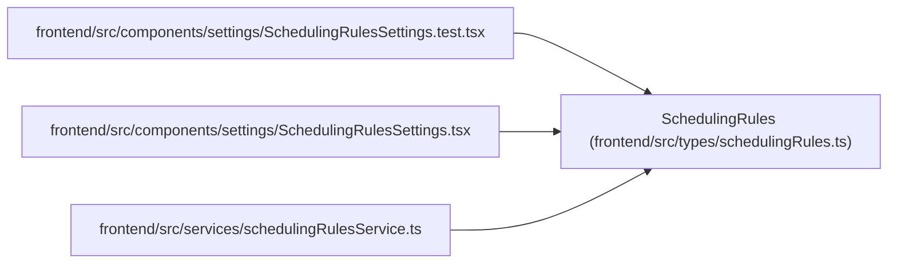

# SchedulingRules

**Location:** `frontend/src/types/schedulingRules.ts:46`
**Kind:** Class
**Bases:** —
**Module:** [schedulingRules](../modules/schedulingRules.md)

## Description

_Auto-generated from `SchedulingRules` in `frontend/src/types/schedulingRules.ts`._

## Attributes

| Name | Type | Required | Default | Description |
|------|------|----------|---------|-------------|
| `schema_version` | `string` | Yes | — | — |
| `effort_modifiers` | `EffortModifier[]` | Yes | — | — |
| `scheduling_passes` | `SchedulingPass[]` | Yes | — | — |
| `constraints` | `Constraints` | Yes | — | — |

## Methods

*No public methods. Inherits from base classes.*

## Relationships

<!-- Auto-generated relationship summary. Do not edit by hand. -->

### Summary

| Module | Methods | Attributes |
|---|---:|---|
| [schedulingRules](../modules/schedulingRules.md) | 0 | `constraints`, `effort_modifiers`, `scheduling_passes`, `schema_version` |

### References

| Reference | Kind | Source | Call sites |
|---|---|---|---:|
| `SchedulingRulesSettings.test` | import | [SchedulingRulesSettings.test](../modules/SchedulingRulesSettings.test.md) | — |
| `SchedulingRulesSettings` | import | [SchedulingRulesSettings](../modules/SchedulingRulesSettings.md) | — |
| `schedulingRulesService` | import | [schedulingRulesService](../modules/schedulingRulesService.md) | — |
