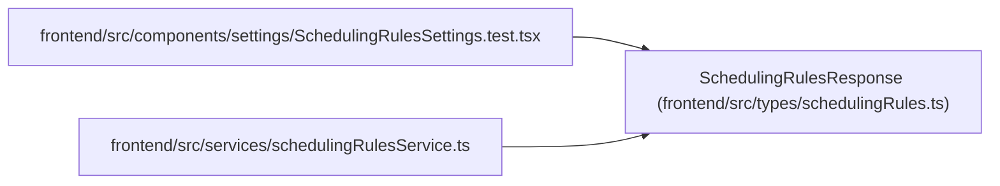

# SchedulingRulesResponse

**Location:** `frontend/src/types/schedulingRules.ts:53`
**Kind:** Class
**Bases:** —
**Module:** [schedulingRules](../modules/schedulingRules.md)

## Description

_Auto-generated from `SchedulingRulesResponse` in `frontend/src/types/schedulingRules.ts`._

## Attributes

| Name | Type | Required | Default | Description |
|------|------|----------|---------|-------------|
| `rules` | `SchedulingRules` | Yes | — | — |
| `source` | `'yaml' \| 'database' \| 'defaults'` | Yes | — | — |

## Methods

*No public methods. Inherits from base classes.*

## Relationships

<!-- Auto-generated relationship summary. Do not edit by hand. -->

### Summary

| Module | Methods | Attributes |
|---|---:|---|
| [schedulingRules](../modules/schedulingRules.md) | 0 | `rules`, `source` |

### References

| Reference | Kind | Source | Call sites |
|---|---|---|---:|
| `SchedulingRulesSettings.test` | import | [SchedulingRulesSettings.test](../modules/SchedulingRulesSettings.test.md) | — |
| `schedulingRulesService` | import | [schedulingRulesService](../modules/schedulingRulesService.md) | — |
