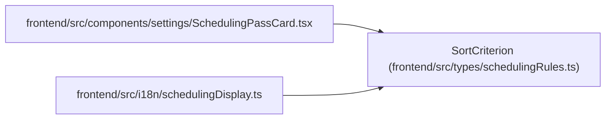

# SortCriterion

**Location:** `frontend/src/types/schedulingRules.ts:6`
**Kind:** Class
**Bases:** —
**Module:** [schedulingRules](../modules/schedulingRules.md)

## Description

Scheduling Rules Types
Mirrors backend SchedulingRulesSchema structure

## Attributes

| Name | Type | Default | Description |
|------|------|---------|-------------|
| `field` | `string` | *required* | — |
| `order` | `'asc' \| 'desc'` | *required* | — |

## Methods

*No public methods. Inherits from base classes.*

## Relationships

<!-- Auto-generated relationship summary. Do not edit by hand. -->

### Summary

| Module | Methods | Attributes |
|---|---:|---|
| [schedulingRules](../modules/schedulingRules.md) | 0 | `field`, `order` |

### References

| Reference | Kind | Source | Call sites |
|---|---|---|---:|
| `SchedulingPassCard` | import | [SchedulingPassCard](../modules/SchedulingPassCard.md) | — |
| `schedulingDisplay` | import | [schedulingDisplay](../modules/schedulingDisplay.md) | — |
