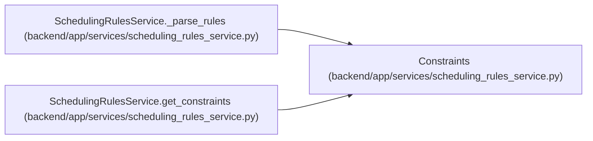

# Constraints

**Location:** `backend/app/services/scheduling_rules_service.py:64`
**Kind:** Class
**Bases:** —
**Module:** [scheduling_rules_service](../modules/scheduling_rules_service.md)

**Decorators:** `@dataclass`

## Description

Scheduling constraints.

## Attributes

| Name | Type | Default | Description |
|------|------|---------|-------------|
| `sequential_per_assignee` | `bool` | `True` | — |
| `respect_dependencies` | `bool` | `True` | — |
| `min_start_date` | `bool` | `True` | — |
| `max_finish_date` | `bool` | `True` | — |
| `prefer_uninterrupted` | `bool` | `True` | — |
| `balance_workload` | `Optional[dict]` | `None` | — |

## Methods

*No public methods. Inherits from base classes.*

## Relationships

<!-- Auto-generated relationship summary. Do not edit by hand. -->

### Summary

| Module | Methods | Attributes |
|---|---:|---|
| [scheduling_rules_service](../modules/scheduling_rules_service.md) | 0 | `balance_workload`, `max_finish_date`, `min_start_date`, `prefer_uninterrupted`, `respect_dependencies`, `sequential_per_assignee` |

### References

| Reference | Kind | Source | Call sites |
|---|---|---|---:|
| `SchedulingRulesService._parse_rules` | call | [scheduling_rules_service](../modules/scheduling_rules_service.md) | 1 |
| `SchedulingRulesService.get_constraints` | call | [scheduling_rules_service](../modules/scheduling_rules_service.md) | 1 |
| `SchedulingRulesService.get_constraints` | type_reference | [scheduling_rules_service](../modules/scheduling_rules_service.md) | — |
