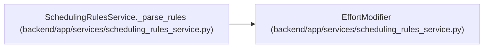

# EffortModifier

**Location:** `backend/app/services/scheduling_rules_service.py:53`
**Kind:** Class
**Bases:** —
**Module:** [scheduling_rules_service](../modules/scheduling_rules_service.md)

**Decorators:** `@dataclass`

## Description

An effort modifier rule.

## Attributes

| Name | Type | Default | Description |
|------|------|---------|-------------|
| `id` | `str` | *required* | — |
| `enabled` | `bool` | *required* | — |
| `formula` | `Optional[str]` | `None` | — |
| `operation` | `Optional[str]` | `None` | — |
| `fallback` | `str` | `'effort'` | — |
| `min_value` | `Optional[float]` | `None` | — |

## Methods

*No public methods. Inherits from base classes.*

## Relationships

<!-- Auto-generated relationship summary. Do not edit by hand. -->

### Summary

| Module | Methods | Attributes |
|---|---:|---|
| [scheduling_rules_service](../modules/scheduling_rules_service.md) | 0 | `enabled`, `fallback`, `formula`, `id`, `min_value`, `operation` |

### References

| Reference | Kind | Source | Call sites |
|---|---|---|---:|
| `SchedulingRulesService._parse_rules` | call | [scheduling_rules_service](../modules/scheduling_rules_service.md) | 1 |
