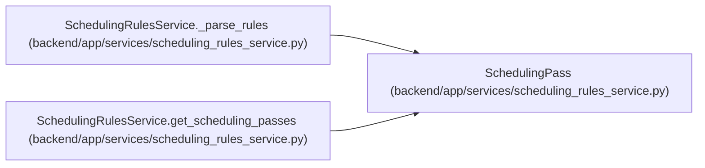

# SchedulingPass

**Location:** `backend/app/services/scheduling_rules_service.py:43`
**Kind:** Class
**Bases:** —
**Module:** [scheduling_rules_service](../modules/scheduling_rules_service.md)

**Decorators:** `@dataclass`

## Description

A scheduling pass with filter and sort rules.

## Attributes

| Name | Type | Default | Description |
|------|------|---------|-------------|
| `id` | `str` | *required* | — |
| `description` | `str` | *required* | — |
| `filter_conditions` | `list[str]` | *required* | — |
| `sort_criteria` | `list[SortCriterion]` | *required* | — |
| `enabled` | `bool` | `True` | — |

## Methods

*No public methods. Inherits from base classes.*

## Relationships

<!-- Auto-generated relationship summary. Do not edit by hand. -->

### Summary

| Module | Methods | Attributes |
|---|---:|---|
| [scheduling_rules_service](../modules/scheduling_rules_service.md) | 0 | `description`, `enabled`, `filter_conditions`, `id`, `sort_criteria` |

### References

| Reference | Kind | Source | Call sites |
|---|---|---|---:|
| `SchedulingRulesService._parse_rules` | call | [scheduling_rules_service](../modules/scheduling_rules_service.md) | 1 |
| `SchedulingRulesService.get_scheduling_passes` | type_reference | [scheduling_rules_service](../modules/scheduling_rules_service.md) | — |
