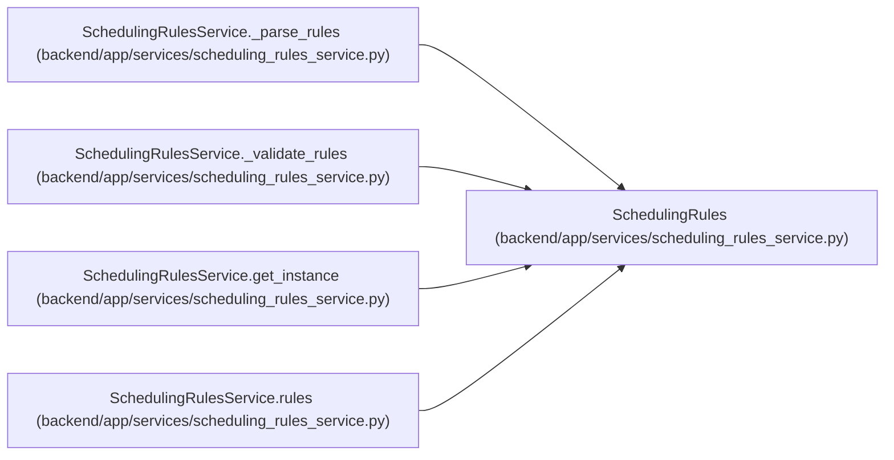

# SchedulingRules

**Location:** `backend/app/services/scheduling_rules_service.py:75`
**Kind:** Class
**Bases:** —
**Module:** [scheduling_rules_service](../modules/scheduling_rules_service.md)

**Decorators:** `@dataclass`

## Description

Complete scheduling rules configuration.

## Attributes

| Name | Type | Default | Description |
|------|------|---------|-------------|
| `schema_version` | `str` | *required* | — |
| `effort_modifiers` | `list[EffortModifier]` | *required* | — |
| `scheduling_passes` | `list[SchedulingPass]` | *required* | — |
| `constraints` | `Constraints` | *required* | — |

## Methods

*No public methods. Inherits from base classes.*

## Relationships

<!-- Auto-generated relationship summary. Do not edit by hand. -->

### Summary

| Module | Methods | Attributes |
|---|---:|---|
| [scheduling_rules_service](../modules/scheduling_rules_service.md) | 0 | `constraints`, `effort_modifiers`, `scheduling_passes`, `schema_version` |

### References

| Reference | Kind | Source | Call sites |
|---|---|---|---:|
| `SchedulingRulesService._parse_rules` | call | [scheduling_rules_service](../modules/scheduling_rules_service.md) | 1 |
| `SchedulingRulesService._parse_rules` | type_reference | [scheduling_rules_service](../modules/scheduling_rules_service.md) | — |
| `SchedulingRulesService._validate_rules` | type_reference | [scheduling_rules_service](../modules/scheduling_rules_service.md) | — |
| `SchedulingRulesService.get_instance` | type_reference | [scheduling_rules_service](../modules/scheduling_rules_service.md) | — |
| `SchedulingRulesService.rules` | type_reference | [scheduling_rules_service](../modules/scheduling_rules_service.md) | — |
