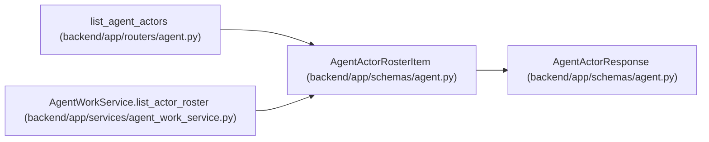

# AgentActorRosterItem

**Location:** `backend/app/schemas/agent.py:730`
**Kind:** Pydantic model
**Bases:** `AgentActorResponse`
**Module:** [schemas_agent](../modules/schemas_agent.md)

## Description

Secret-free actor dispatch roster item.

## Attributes

| Name | Type | Wire name | Required | Nullable | Default | Constraints | Examples | Description |
|------|------|-----------|----------|----------|---------|-------------|-------------|----------|
| `actor_revision` | `int` | `actor_revision` | No | No | `1` | — | — | — |
| `profile_revision` | `Optional[str]` | `profile_revision` | No | Yes | `None` | — | — | — |
| `profile` | `Optional[AgentActorRosterProfile]` | `profile` | No | Yes | `None` | — | — | — |
| `eligible_model_bindings` | `list[AgentModelBindingResponse]` | `eligible_model_bindings` | No | No | factory: `list` | — | — | — |
| `queued_assignments` | `int` | `queued_assignments` | No | No | `0` | — | — | — |
| `accepted_assignments` | `int` | `accepted_assignments` | No | No | `0` | — | — | — |
| `running_runs` | `int` | `running_runs` | No | No | `0` | — | — | — |

## Methods

*No public methods. Inherits from base classes.*

## Relationships

<!-- Auto-generated relationship summary. Do not edit by hand. -->

### Summary

| Module | Methods | Attributes |
|---|---:|---|
| [schemas_agent](../modules/schemas_agent.md) | 0 | `accepted_assignments`, `actor_revision`, `eligible_model_bindings`, `profile`, `profile_revision`, `queued_assignments`, `running_runs` |

### Structure

| Kind | Entity | Module |
|---|---|---|
| Base | `AgentActorResponse` | [schemas_agent](../modules/schemas_agent.md) |

### References

| Reference | Kind | Source | Call sites |
|---|---|---|---:|
| `list_agent_actors` | type_reference | [routers_agent](../modules/routers_agent.md) | — |
| `AgentWorkService.list_actor_roster` | call | [agent_work_service](../modules/agent_work_service.md) | 1 |
| `AgentWorkService.list_actor_roster` | type_reference | [agent_work_service](../modules/agent_work_service.md) | — |
