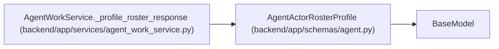

# AgentActorRosterProfile

**Location:** `backend/app/schemas/agent.py:717`
**Kind:** Pydantic model
**Bases:** `BaseModel`
**Module:** [schemas_agent](../modules/schemas_agent.md)

## Description

Secret-free profile projection used for exact-actor routing.

## Attributes

| Name | Type | Wire name | Required | Nullable | Default | Constraints | Examples | Description |
|------|------|-----------|----------|----------|---------|-------------|-------------|----------|
| `id` | `int` | `id` | Yes | No | — | — | — | — |
| `revision` | `str` | `revision` | Yes | No | — | — | — | — |
| `display_name` | `str` | `display_name` | Yes | No | — | — | — | — |
| `automation_enabled` | `bool` | `automation_enabled` | Yes | No | — | — | — | — |
| `profile_kind` | `str` | `profile_kind` | Yes | No | — | — | — | — |
| `assignment_modes` | `list[str]` | `assignment_modes` | No | No | factory: `list` | — | — | — |
| `skills` | `list[AgentActorRosterProfileSkill]` | `skills` | No | No | factory: `list` | — | — | — |
| `updated_at` | `datetime` | `updated_at` | Yes | No | — | — | — | — |

## Methods

*No public methods. Inherits from base classes.*

## Relationships

<!-- Auto-generated relationship summary. Do not edit by hand. -->

### Summary

| Module | Methods | Attributes |
|---|---:|---|
| [schemas_agent](../modules/schemas_agent.md) | 0 | `assignment_modes`, `automation_enabled`, `display_name`, `id`, `profile_kind`, `revision`, `skills`, `updated_at` |

### Structure

| Kind | Entity | Module |
|---|---|---|
| Base | `BaseModel` | — |

### References

| Reference | Kind | Source | Call sites |
|---|---|---|---:|
| `AgentWorkService._profile_roster_response` | call | [agent_work_service](../modules/agent_work_service.md) | 1 |
| `AgentWorkService._profile_roster_response` | type_reference | [agent_work_service](../modules/agent_work_service.md) | — |
