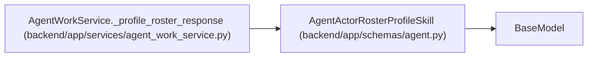

# AgentActorRosterProfileSkill

**Location:** `backend/app/schemas/agent.py:711`
**Kind:** Pydantic model
**Bases:** `BaseModel`
**Module:** [schemas_agent](../modules/schemas_agent.md)

## Description

Bounded capability evidence attached to one roster profile.

## Attributes

| Name | Type | Wire name | Required | Nullable | Default | Constraints | Examples | Description |
|------|------|-----------|----------|----------|---------|-------------|-------------|----------|
| `id` | `int` | `id` | Yes | No | — | — | — | — |
| `skill_key` | `str` | `skill_key` | Yes | No | — | — | — | — |
| `skill_name` | `str` | `skill_name` | Yes | No | — | — | — | — |
| `category` | `Optional[str]` | `category` | No | Yes | `None` | — | — | — |
| `level` | `int` | `level` | Yes | No | — | — | — | — |
| `interest` | `int` | `interest` | Yes | No | — | — | — | — |
| `is_weakness` | `bool` | `is_weakness` | Yes | No | — | — | — | — |
| `updated_at` | `datetime` | `updated_at` | Yes | No | — | — | — | — |

## Methods

*No public methods. Inherits from base classes.*

## Relationships

<!-- Auto-generated relationship summary. Do not edit by hand. -->

### Summary

| Module | Methods | Attributes |
|---|---:|---|
| [schemas_agent](../modules/schemas_agent.md) | 0 | `category`, `id`, `interest`, `is_weakness`, `level`, `skill_key`, `skill_name`, `updated_at` |

### Structure

| Kind | Entity | Module |
|---|---|---|
| Base | `BaseModel` | — |

### References

| Reference | Kind | Source | Call sites |
|---|---|---|---:|
| `AgentWorkService._profile_roster_response` | call | [agent_work_service](../modules/agent_work_service.md) | 1 |
