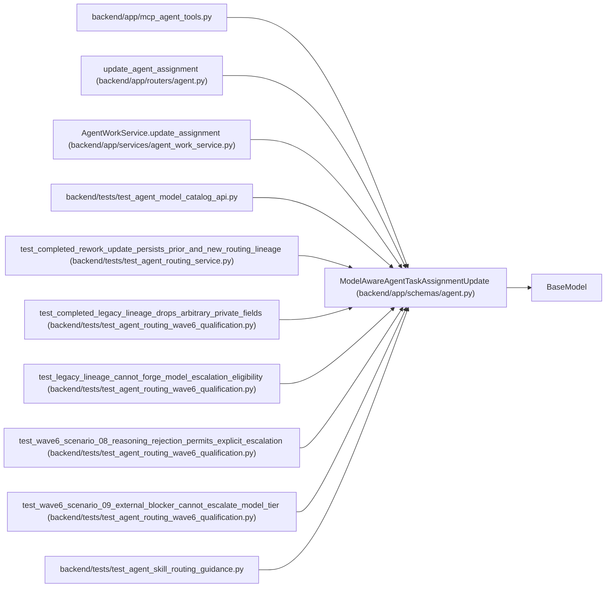

# ModelAwareAgentTaskAssignmentUpdate

**Location:** `backend/app/schemas/agent.py:592`
**Kind:** Pydantic model
**Bases:** `BaseModel`
**Module:** [schemas_agent](../modules/schemas_agent.md)

## Description

PM command to reroute queued work through a fresh routing preview.

## Model Configuration

| Setting | Value | Source |
|---------|-------|--------|
| `extra` | `'forbid'` | model_config |

## Validators

| Method | Scope | Fields | Mode | Options |
|--------|-------|--------|------|---------|
| `normalize_routing_preview_id` | field | routing_preview_id | after | — |
| `normalize_routing_preview_digest` | field | routing_preview_digest | after | — |

## Attributes

| Name | Type | Wire name | Required | Nullable | Default | Constraints | Examples | Description |
|------|------|-----------|----------|----------|---------|-------------|-------------|----------|
| `expected_queue_revision` | `int` | `expected_queue_revision` | Yes | No | — | ge=1 | — | — |
| `assessment_id` | `int` | `assessment_id` | Yes | No | — | ge=1 | — | — |
| `model_binding_id` | `int` | `model_binding_id` | Yes | No | — | ge=1 | — | — |
| `model_binding_revision` | `int` | `model_binding_revision` | Yes | No | — | ge=1 | — | — |
| `routing_preview_id` | `str` | `routing_preview_id` | Yes | No | — | max_length=255; min_length=1 | — | — |
| `routing_preview_digest` | `str` | `routing_preview_digest` | Yes | No | — | max_length=64; min_length=64 | — | — |
| `actor_id` | `Optional[int]` | `actor_id` | No | Yes | `None` | ge=1 | — | — |
| `reviewer_profile_id` | `Optional[int]` | `reviewer_profile_id` | No | Yes | `None` | ge=1 | — | — |
| `queue_rank` | `Optional[int]` | `queue_rank` | No | Yes | `None` | ge=0 | — | — |
| `not_before` | `Optional[datetime]` | `not_before` | No | Yes | `None` | — | — | — |
| `state` | `Optional[Literal['queued', 'cancelled']]` | `state` | No | Yes | `None` | — | — | — |
| `reason` | `Optional[str]` | `reason` | No | Yes | `None` | max_length=unknown (MAX_AGENT_TEXT_LENGTH) | — | — |

## Methods

| Method | Signature | Decorators | Description |
|--------|-----------|------------|-------------|
| `normalize_routing_preview_id` | `(value: str) -> str` | `@field_validator('routing_preview_id')`, `@classmethod` | — |
| `normalize_routing_preview_digest` | `(value: str) -> str` | `@field_validator('routing_preview_digest')`, `@classmethod` | — |

## Relationships

<!-- Auto-generated relationship summary. Do not edit by hand. -->

### Summary

| Module | Methods | Attributes |
|---|---:|---|
| [schemas_agent](../modules/schemas_agent.md) | 2 | `actor_id`, `assessment_id`, `expected_queue_revision`, `model_binding_id`, `model_binding_revision`, `not_before`, `queue_rank`, `reason`, `reviewer_profile_id`, `routing_preview_digest`, `routing_preview_id`, `state` |

### Structure

| Kind | Entity | Module |
|---|---|---|
| Base | `BaseModel` | — |

### References

| Reference | Kind | Source | Call sites |
|---|---|---|---:|
| `mcp_agent_tools` | import | [mcp_agent_tools](../modules/mcp_agent_tools.md) | — |
| `update_agent_assignment` | type_reference | [routers_agent](../modules/routers_agent.md) | — |
| `AgentWorkService.update_assignment` | type_reference | [agent_work_service](../modules/agent_work_service.md) | — |
| `test_agent_model_catalog_api` | import | [test_agent_model_catalog_api](../modules/test_agent_model_catalog_api.md) | — |
| `test_completed_rework_update_persists_prior_and_new_routing_lineage` | call | [test_agent_routing_service](../modules/test_agent_routing_service.md) | 1 |
| `test_completed_legacy_lineage_drops_arbitrary_private_fields` | call | [test_agent_routing_wave6_qualification](../modules/test_agent_routing_wave6_qualification.md) | 1 |
| `test_legacy_lineage_cannot_forge_model_escalation_eligibility` | call | [test_agent_routing_wave6_qualification](../modules/test_agent_routing_wave6_qualification.md) | 1 |
| `test_wave6_scenario_08_reasoning_rejection_permits_explicit_escalation` | call | [test_agent_routing_wave6_qualification](../modules/test_agent_routing_wave6_qualification.md) | 1 |
| `test_wave6_scenario_09_external_blocker_cannot_escalate_model_tier` | call | [test_agent_routing_wave6_qualification](../modules/test_agent_routing_wave6_qualification.md) | 1 |
| `test_agent_skill_routing_guidance` | import | [test_agent_skill_routing_guidance](../modules/test_agent_skill_routing_guidance.md) | — |
