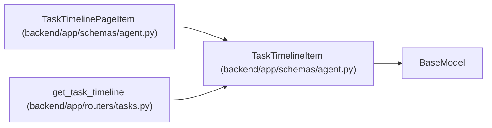

# TaskTimelineItem

**Location:** `backend/app/schemas/agent.py:445`
**Kind:** Pydantic model
**Bases:** `BaseModel`
**Module:** [schemas_agent](../modules/schemas_agent.md)

## Description

Merged timeline item for a task.

## Attributes

| Name | Type | Wire name | Required | Nullable | Default | Constraints | Examples | Description |
|------|------|-----------|----------|----------|---------|-------------|-------------|----------|
| `item_type` | `Literal['task_event', 'status_log', 'agent_run', 'agent_run_event']` | `item_type` | Yes | No | — | — | — | — |
| `timestamp` | `datetime` | `timestamp` | Yes | No | — | — | — | — |
| `title` | `str` | `title` | Yes | No | — | — | — | — |
| `payload` | `dict[str, Any]` | `payload` | No | No | factory: `dict` | — | — | — |
| `actor_type` | `Optional[str]` | `actor_type` | No | Yes | `None` | — | — | — |
| `actor_id` | `Optional[int]` | `actor_id` | No | Yes | `None` | — | — | — |
| `trace_id` | `Optional[str]` | `trace_id` | No | Yes | `None` | — | — | — |

## Methods

*No public methods. Inherits from base classes.*

## Relationships

<!-- Auto-generated relationship summary. Do not edit by hand. -->

### Summary

| Module | Methods | Attributes |
|---|---:|---|
| [schemas_agent](../modules/schemas_agent.md) | 0 | `actor_id`, `actor_type`, `item_type`, `payload`, `timestamp`, `title`, `trace_id` |

### Structure

| Kind | Entity | Module |
|---|---|---|
| Base | `BaseModel` | — |
| Subclass | `TaskTimelinePageItem` | [schemas_agent](../modules/schemas_agent.md) |

### References

| Reference | Kind | Source | Call sites |
|---|---|---|---:|
| `get_task_timeline` | call | [tasks](../modules/tasks.md) | 1 |
