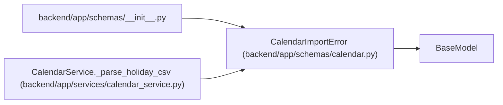

# CalendarImportError

**Location:** `backend/app/schemas/calendar.py:50`
**Kind:** Pydantic model
**Bases:** `BaseModel`
**Module:** [schemas_calendar](../modules/schemas_calendar.md)

## Description

One calendar import row that could not be applied.

## Attributes

| Name | Type | Wire name | Required | Nullable | Default | Constraints | Examples | Description |
|------|------|-----------|----------|----------|---------|-------------|-------------|----------|
| `row` | `int` | `row` | Yes | No | — | — | — | — |
| `message` | `str` | `message` | Yes | No | — | — | — | — |

## Methods

*No public methods. Inherits from base classes.*

## Relationships

<!-- Auto-generated relationship summary. Do not edit by hand. -->

### Summary

| Module | Methods | Attributes |
|---|---:|---|
| [schemas_calendar](../modules/schemas_calendar.md) | 0 | `message`, `row` |

### Structure

| Kind | Entity | Module |
|---|---|---|
| Base | `BaseModel` | — |

### References

| Reference | Kind | Source | Call sites |
|---|---|---|---:|
| `__init__` | import | [schemas___init__](../modules/schemas___init__.md) | — |
| `CalendarService._parse_holiday_csv` | call | [calendar_service](../modules/calendar_service.md) | 2 |
| `CalendarService._parse_holiday_csv` | type_reference | [calendar_service](../modules/calendar_service.md) | — |
