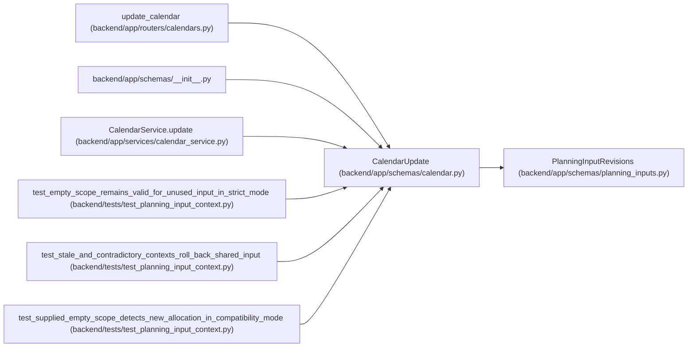

# CalendarUpdate

**Location:** `backend/app/schemas/calendar.py:22`
**Kind:** Pydantic model
**Bases:** `PlanningInputRevisions`
**Module:** [schemas_calendar](../modules/schemas_calendar.md)

## Description

Schema for updating a calendar.

## Attributes

| Name | Type | Wire name | Required | Nullable | Default | Constraints | Examples | Description |
|------|------|-----------|----------|----------|---------|-------------|-------------|----------|
| `timezone` | `WorkingZone \| None` | `timezone` | No | Yes | `None` | — | — | — |
| `nominal_day_hours` | `float \| None` | `nominal_day_hours` | No | Yes | `None` | allow_inf_nan=False; gt=0; le=24 | — | — |
| `name` | `Optional[str]` | `name` | No | Yes | `None` | max_length=255; min_length=1 | — | — |
| `year` | `Optional[int]` | `year` | No | Yes | `None` | ge=2000; le=2100 | — | — |
| `holidays` | `Optional[list[str]]` | `holidays` | No | Yes | `None` | — | — | — |
| `weekend_days` | `Optional[list[int]]` | `weekend_days` | No | Yes | `None` | — | — | — |
| `short_days` | `Optional[list[str]]` | `short_days` | No | Yes | `None` | — | — | — |

## Methods

*No public methods. Inherits from base classes.*

## Relationships

<!-- Auto-generated relationship summary. Do not edit by hand. -->

### Summary

| Module | Methods | Attributes |
|---|---:|---|
| [schemas_calendar](../modules/schemas_calendar.md) | 0 | `holidays`, `name`, `nominal_day_hours`, `short_days`, `timezone`, `weekend_days`, `year` |

### Structure

| Kind | Entity | Module |
|---|---|---|
| Base | `PlanningInputRevisions` | [planning_inputs](../modules/planning_inputs.md) |

### References

| Reference | Kind | Source | Call sites |
|---|---|---|---:|
| `update_calendar` | type_reference | [calendars](../modules/calendars.md) | — |
| `__init__` | import | [schemas___init__](../modules/schemas___init__.md) | — |
| `CalendarService.update` | type_reference | [calendar_service](../modules/calendar_service.md) | — |
| `test_empty_scope_remains_valid_for_unused_input_in_strict_mode` | call | [test_planning_input_context](../modules/test_planning_input_context.md) | 1 |
| `test_stale_and_contradictory_contexts_roll_back_shared_input` | call | [test_planning_input_context](../modules/test_planning_input_context.md) | 3 |
| `test_supplied_empty_scope_detects_new_allocation_in_compatibility_mode` | call | [test_planning_input_context](../modules/test_planning_input_context.md) | 1 |
