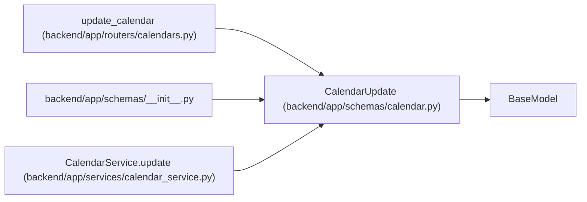

# CalendarUpdate

**Location:** `backend/app/schemas/calendar.py:17`
**Kind:** Pydantic model
**Bases:** `BaseModel`
**Module:** [schemas_calendar](../modules/schemas_calendar.md)

## Description

Schema for updating a calendar.

## Attributes

| Name | Type | Wire name | Required | Nullable | Default | Constraints | Examples | Description |
|------|------|-----------|----------|----------|---------|-------------|-------------|----------|
| `name` | `Optional[str]` | `name` | No | Yes | `None` | min_length=1; max_length=255 | — | — |
| `year` | `Optional[int]` | `year` | No | Yes | `None` | ge=2000; le=2100 | — | — |
| `holidays` | `Optional[list[str]]` | `holidays` | No | Yes | `None` | — | — | — |
| `weekend_days` | `Optional[list[int]]` | `weekend_days` | No | Yes | `None` | — | — | — |
| `short_days` | `Optional[list[str]]` | `short_days` | No | Yes | `None` | — | — | — |

## Methods

*No public methods. Inherits from base classes.*

## Relationships

<!-- Auto-generated relationship summary. Do not edit by hand. -->

### Summary

| Module | Methods | Attributes |
|---|---:|---|
| [schemas_calendar](../modules/schemas_calendar.md) | 0 | `holidays`, `name`, `short_days`, `weekend_days`, `year` |

### Structure

| Kind | Entity | Module |
|---|---|---|
| Base | `BaseModel` | — |

### References

| Reference | Kind | Source | Call sites |
|---|---|---|---:|
| `update_calendar` | type_reference | [calendars](../modules/calendars.md) | — |
| `__init__` | import | [schemas___init__](../modules/schemas___init__.md) | — |
| `CalendarService.update` | type_reference | [calendar_service](../modules/calendar_service.md) | — |
