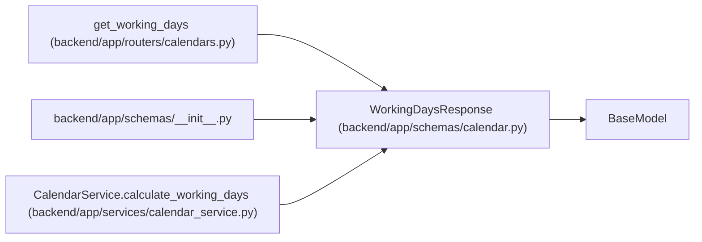

# WorkingDaysResponse

**Location:** `backend/app/schemas/calendar.py:67`
**Kind:** Pydantic model
**Bases:** `BaseModel`
**Module:** [schemas_calendar](../modules/schemas_calendar.md)

## Description

Response with working days calculation.

## Attributes

| Name | Type | Wire name | Required | Nullable | Default | Constraints | Examples | Description |
|------|------|-----------|----------|----------|---------|-------------|-------------|----------|
| `start_date` | `date` | `start_date` | Yes | No | — | — | — | — |
| `end_date` | `date` | `end_date` | Yes | No | — | — | — | — |
| `total_days` | `int` | `total_days` | Yes | No | — | — | — | — |
| `working_days` | `int` | `working_days` | Yes | No | — | — | — | — |
| `holidays` | `list[date]` | `holidays` | Yes | No | — | — | — | — |
| `weekends` | `list[date]` | `weekends` | Yes | No | — | — | — | — |

## Methods

*No public methods. Inherits from base classes.*

## Relationships

<!-- Auto-generated relationship summary. Do not edit by hand. -->

### Summary

| Module | Methods | Attributes |
|---|---:|---|
| [schemas_calendar](../modules/schemas_calendar.md) | 0 | `end_date`, `holidays`, `start_date`, `total_days`, `weekends`, `working_days` |

### Structure

| Kind | Entity | Module |
|---|---|---|
| Base | `BaseModel` | — |

### References

| Reference | Kind | Source | Call sites |
|---|---|---|---:|
| `get_working_days` | type_reference | [calendars](../modules/calendars.md) | — |
| `__init__` | import | [schemas___init__](../modules/schemas___init__.md) | — |
| `CalendarService.calculate_working_days` | call | [calendar_service](../modules/calendar_service.md) | 1 |
| `CalendarService.calculate_working_days` | type_reference | [calendar_service](../modules/calendar_service.md) | — |
