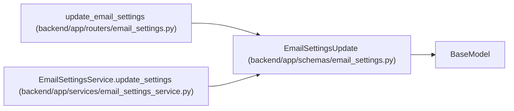

# EmailSettingsUpdate

**Location:** `backend/app/schemas/email_settings.py:7`
**Kind:** Pydantic model
**Bases:** `BaseModel`
**Module:** [schemas_email_settings](../modules/schemas_email_settings.md)

## Description

Schema for updating email settings.

## Attributes

| Name | Type | Wire name | Required | Nullable | Default | Constraints | Examples | Description |
|------|------|-----------|----------|----------|---------|-------------|-------------|----------|
| `enabled` | `bool` | `enabled` | No | No | `False` | — | — | — |
| `smtp_host` | `str` | `smtp_host` | No | No | `''` | — | — | — |
| `smtp_port` | `int` | `smtp_port` | No | No | `587` | ge=1; le=65535 | — | — |
| `smtp_user` | `str` | `smtp_user` | No | No | `''` | — | — | — |
| `smtp_password` | `str \| None` | `smtp_password` | No | Yes | `None` | — | — | — |
| `smtp_from_email` | `str` | `smtp_from_email` | No | No | `'notifications@workchord.local'` | — | — | — |
| `smtp_use_tls` | `bool` | `smtp_use_tls` | No | No | `True` | — | — | — |
| `clear_smtp_password` | `bool` | `clear_smtp_password` | No | No | `False` | — | — | — |
| `reset_fields` | `list[str]` | `reset_fields` | No | No | factory: `list` | — | — | — |

## Methods

*No public methods. Inherits from base classes.*

## Relationships

<!-- Auto-generated relationship summary. Do not edit by hand. -->

### Summary

| Module | Methods | Attributes |
|---|---:|---|
| [schemas_email_settings](../modules/schemas_email_settings.md) | 0 | `clear_smtp_password`, `enabled`, `reset_fields`, `smtp_from_email`, `smtp_host`, `smtp_password`, `smtp_port`, `smtp_use_tls`, `smtp_user` |

### Structure

| Kind | Entity | Module |
|---|---|---|
| Base | `BaseModel` | — |

### References

| Reference | Kind | Source | Call sites |
|---|---|---|---:|
| `update_email_settings` | type_reference | [routers_email_settings](../modules/routers_email_settings.md) | — |
| `EmailSettingsService.update_settings` | call | [email_settings_service](../modules/email_settings_service.md) | 1 |
