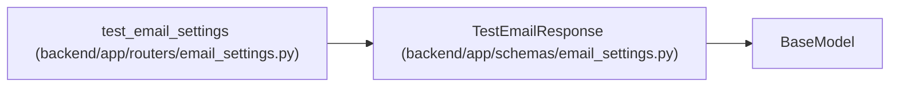

# TestEmailResponse

**Location:** `backend/app/schemas/email_settings.py:37`
**Kind:** Pydantic model
**Bases:** `BaseModel`
**Module:** [schemas_email_settings](../modules/schemas_email_settings.md)

## Description

Schema for test email response.

## Attributes

| Name | Type | Wire name | Required | Nullable | Default | Constraints | Examples | Description |
|------|------|-----------|----------|----------|---------|-------------|-------------|----------|
| `success` | `bool` | `success` | Yes | No | — | — | — | — |
| `message` | `str` | `message` | Yes | No | — | — | — | — |

## Methods

*No public methods. Inherits from base classes.*

## Relationships

<!-- Auto-generated relationship summary. Do not edit by hand. -->

### Summary

| Module | Methods | Attributes |
|---|---:|---|
| [schemas_email_settings](../modules/schemas_email_settings.md) | 0 | `message`, `success` |

### Structure

| Kind | Entity | Module |
|---|---|---|
| Base | `BaseModel` | — |

### References

| Reference | Kind | Source | Call sites |
|---|---|---|---:|
| `test_email_settings` | call | [routers_email_settings](../modules/routers_email_settings.md) | 1 |
| `test_email_settings` | type_reference | [routers_email_settings](../modules/routers_email_settings.md) | — |
