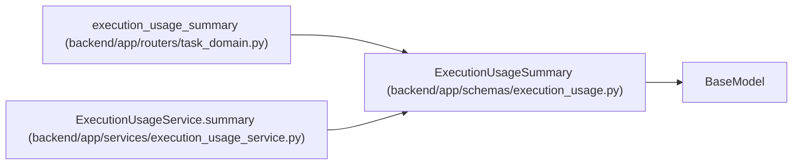

# ExecutionUsageSummary

**Location:** `backend/app/schemas/execution_usage.py:74`
**Kind:** Pydantic model
**Bases:** `BaseModel`
**Module:** [schemas_execution_usage](../modules/schemas_execution_usage.md)

## Description

_Auto-generated from `ExecutionUsageSummary` in `backend/app/schemas/execution_usage.py`._

## Attributes

| Name | Type | Wire name | Required | Nullable | Default | Constraints | Examples | Description |
|------|------|-----------|----------|----------|---------|-------------|-------------|----------|
| `window_start` | `datetime` | `window_start` | Yes | No | — | — | — | — |
| `window_end` | `datetime` | `window_end` | Yes | No | — | — | — | — |
| `window_basis` | `str` | `window_basis` | No | No | `'run_start_or_report_receipt'` | — | — | — |
| `expected_runs` | `int` | `expected_runs` | Yes | No | — | — | — | — |
| `reported_runs` | `int` | `reported_runs` | Yes | No | — | — | — | — |
| `unreported_runs` | `int` | `unreported_runs` | Yes | No | — | — | — | — |
| `partial_reports` | `int` | `partial_reports` | Yes | No | — | — | — | — |
| `unavailable_reports` | `int` | `unavailable_reports` | Yes | No | — | — | — | — |
| `simulated_reports` | `int` | `simulated_reports` | Yes | No | — | — | — | — |
| `provider_reported_cost` | `dict[str, Decimal \| None]` | `provider_reported_cost` | Yes | No | — | — | — | — |
| `estimated_cost` | `dict[str, Decimal \| None]` | `estimated_cost` | Yes | No | — | — | — | — |
| `known_cost_reports` | `dict[str, int]` | `known_cost_reports` | Yes | No | — | — | — | — |
| `unknown_cost_reports` | `int` | `unknown_cost_reports` | Yes | No | — | — | — | — |
| `accepted_task_identities` | `int` | `accepted_task_identities` | Yes | No | — | — | — | — |
| `reports_linked_to_accepted_tasks` | `int` | `reports_linked_to_accepted_tasks` | Yes | No | — | — | — | — |
| `reported_human_effort_minutes` | `Decimal \| None` | `reported_human_effort_minutes` | Yes | Yes | — | — | — | — |
| `human_effort_reports` | `int` | `human_effort_reports` | Yes | No | — | — | — | — |
| `linked_delivery` | `dict` | `linked_delivery` | No | No | factory: `dict` | — | — | — |
| `reported_units` | `dict[str, Decimal \| None]` | `reported_units` | No | No | factory: `dict` | — | — | — |
| `unit_report_counts` | `dict[str, int]` | `unit_report_counts` | No | No | factory: `dict` | — | — | — |
| `simulated_reported_cost` | `dict[str, Decimal]` | `simulated_reported_cost` | No | No | factory: `dict` | — | — | — |
| `simulated_estimated_cost` | `dict[str, Decimal]` | `simulated_estimated_cost` | No | No | factory: `dict` | — | — | — |
| `simulated_units` | `dict[str, Decimal \| None]` | `simulated_units` | No | No | factory: `dict` | — | — | — |
| `measured_report_count` | `int` | `measured_report_count` | No | No | `0` | — | — | — |
| `advisory_budget` | `dict \| None` | `advisory_budget` | No | Yes | `None` | — | — | — |
| `scope_basis` | `str` | `scope_basis` | No | No | `'scope_at_first_report'` | — | — | — |
| `independently_reconciled` | `Literal[False]` | `independently_reconciled` | No | No | `False` | — | — | — |

## Methods

*No public methods. Inherits from base classes.*

## Relationships

<!-- Auto-generated relationship summary. Do not edit by hand. -->

### Summary

| Module | Methods | Attributes |
|---|---:|---|
| [schemas_execution_usage](../modules/schemas_execution_usage.md) | 0 | `accepted_task_identities`, `advisory_budget`, `estimated_cost`, `expected_runs`, `human_effort_reports`, `independently_reconciled`, `known_cost_reports`, `linked_delivery`, `measured_report_count`, `partial_reports`, `provider_reported_cost`, `reported_human_effort_minutes` |

### Structure

| Kind | Entity | Module |
|---|---|---|
| Base | `BaseModel` | — |

### References

| Reference | Kind | Source | Call sites |
|---|---|---|---:|
| `execution_usage_summary` | type_reference | [routers_task_domain](../modules/routers_task_domain.md) | — |
| `ExecutionUsageService.summary` | call | [execution_usage_service](../modules/execution_usage_service.md) | 1 |
