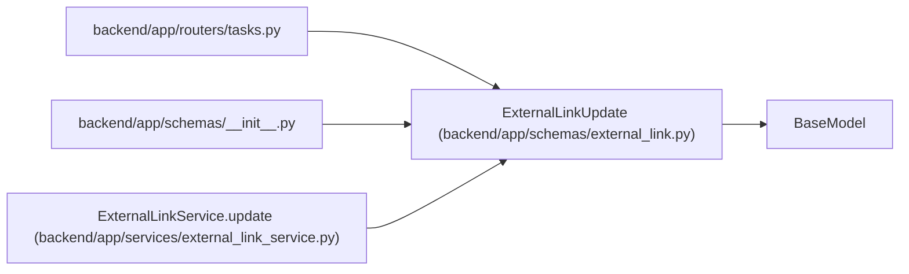

# ExternalLinkUpdate

**Location:** `backend/app/schemas/external_link.py:89`
**Kind:** Pydantic model
**Bases:** `BaseModel`
**Module:** [schemas_external_link](../modules/schemas_external_link.md)

## Description

Schema for updating an external link.

## Model Configuration

| Setting | Value | Source |
|---------|-------|--------|
| `extra` | `'forbid'` | model_config |

## Validators

| Method | Scope | Fields | Mode | Options |
|--------|-------|--------|------|---------|
| `validate_url` | field | url | after | — |
| `validate_metadata_json` | field | metadata_json | before | — |

## Attributes

| Name | Type | Wire name | Required | Nullable | Default | Constraints | Examples | Description |
|------|------|-----------|----------|----------|---------|-------------|-------------|----------|
| `provider` | `Optional[ExternalLinkProvider]` | `provider` | No | Yes | `None` | — | — | — |
| `external_key` | `Optional[str]` | `external_key` | No | Yes | `None` | max_length=255 | — | — |
| `url` | `Optional[str]` | `url` | No | Yes | `None` | max_length=1000 | — | — |
| `title` | `Optional[str]` | `title` | No | Yes | `None` | max_length=500 | — | — |
| `status` | `Optional[str]` | `status` | No | Yes | `None` | max_length=100 | — | — |
| `metadata_json` | `Optional[dict[str, Any]]` | `metadata_json` | No | Yes | `None` | — | — | — |

## Methods

| Method | Signature | Decorators | Description |
|--------|-----------|------------|-------------|
| `validate_url` | `(value: Optional[str]) -> Optional[str]` | `@field_validator('url')`, `@classmethod` | — |
| `validate_metadata_json` | `(value)` | `@field_validator('metadata_json', mode='before')`, `@classmethod` | Require metadata_json updates to be JSON objects. |

## Relationships

<!-- Auto-generated relationship summary. Do not edit by hand. -->

### Summary

| Module | Methods | Attributes |
|---|---:|---|
| [schemas_external_link](../modules/schemas_external_link.md) | 2 | `external_key`, `metadata_json`, `provider`, `status`, `title`, `url` |

### Structure

| Kind | Entity | Module |
|---|---|---|
| Base | `BaseModel` | — |

### References

| Reference | Kind | Source | Call sites |
|---|---|---|---:|
| `tasks` | import | [tasks](../modules/tasks.md) | — |
| `__init__` | import | [schemas___init__](../modules/schemas___init__.md) | — |
| `ExternalLinkService.update` | type_reference | [external_link_service](../modules/external_link_service.md) | — |
