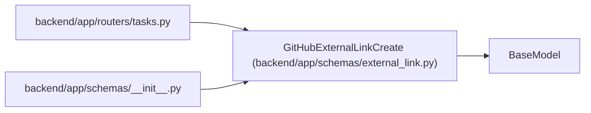

# GitHubExternalLinkCreate

**Location:** `backend/app/schemas/external_link.py:74`
**Kind:** Pydantic model
**Bases:** `BaseModel`
**Module:** [schemas_external_link](../modules/schemas_external_link.md)

## Description

Schema for manually linking a GitHub artifact to a task.

## Model Configuration

| Setting | Value | Source |
|---------|-------|--------|
| `extra` | `'forbid'` | model_config |

## Validators

| Method | Scope | Fields | Mode | Options |
|--------|-------|--------|------|---------|
| `validate_url` | field | url | after | — |

## Attributes

| Name | Type | Wire name | Required | Nullable | Default | Constraints | Examples | Description |
|------|------|-----------|----------|----------|---------|-------------|-------------|----------|
| `url` | `str` | `url` | Yes | No | — | min_length=1; max_length=1000 | — | — |

## Methods

| Method | Signature | Decorators | Description |
|--------|-----------|------------|-------------|
| `validate_url` | `(value: str) -> str` | `@field_validator('url')`, `@classmethod` | — |

## Relationships

<!-- Auto-generated relationship summary. Do not edit by hand. -->

### Summary

| Module | Methods | Attributes |
|---|---:|---|
| [schemas_external_link](../modules/schemas_external_link.md) | 1 | `url` |

### Structure

| Kind | Entity | Module |
|---|---|---|
| Base | `BaseModel` | — |

### References

| Reference | Kind | Source | Call sites |
|---|---|---|---:|
| `tasks` | import | [tasks](../modules/tasks.md) | — |
| `__init__` | import | [schemas___init__](../modules/schemas___init__.md) | — |
