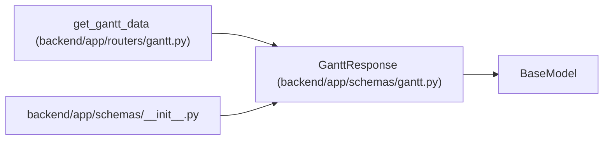

# GanttResponse

**Location:** `backend/app/schemas/gantt.py:84`
**Kind:** Pydantic model
**Bases:** `BaseModel`
**Module:** [schemas_gantt](../modules/schemas_gantt.md)

## Description

Full Gantt chart response.

## Attributes

| Name | Type | Wire name | Required | Nullable | Default | Constraints | Examples | Description |
|------|------|-----------|----------|----------|---------|-------------|-------------|----------|
| `iteration` | `IterationResponse` | `iteration` | Yes | No | — | — | — | — |
| `tasks` | `list[GanttTask]` | `tasks` | Yes | No | — | — | — | — |
| `overdue_task_ids` | `list[int]` | `overdue_task_ids` | No | No | `[]` | — | — | — |
| `holidays` | `list[date]` | `holidays` | No | No | `[]` | — | — | — |
| `weekends` | `list[date]` | `weekends` | No | No | `[]` | — | — | — |
| `member_vacations` | `dict[int, list[date]]` | `member_vacations` | No | No | `{}` | — | — | — |
| `schedule_result` | `Optional[ScheduleResult]` | `schedule_result` | No | Yes | `None` | — | — | — |

## Methods

*No public methods. Inherits from base classes.*

## Relationships

<!-- Auto-generated relationship summary. Do not edit by hand. -->

### Summary

| Module | Methods | Attributes |
|---|---:|---|
| [schemas_gantt](../modules/schemas_gantt.md) | 0 | `holidays`, `iteration`, `member_vacations`, `overdue_task_ids`, `schedule_result`, `tasks`, `weekends` |

### Structure

| Kind | Entity | Module |
|---|---|---|
| Base | `BaseModel` | — |

### References

| Reference | Kind | Source | Call sites |
|---|---|---|---:|
| `get_gantt_data` | call | [routers_gantt](../modules/routers_gantt.md) | 1 |
| `get_gantt_data` | type_reference | [routers_gantt](../modules/routers_gantt.md) | — |
| `__init__` | import | [schemas___init__](../modules/schemas___init__.md) | — |
