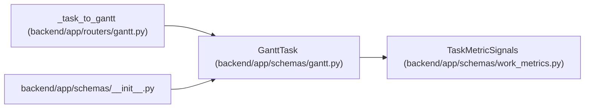

# GanttTask

**Location:** `backend/app/schemas/gantt.py:28`
**Kind:** Pydantic model
**Bases:** `TaskMetricSignals`
**Module:** [schemas_gantt](../modules/schemas_gantt.md)

## Description

Task representation for Gantt chart.

## Attributes

| Name | Type | Wire name | Required | Nullable | Default | Constraints | Examples | Description |
|------|------|-----------|----------|----------|---------|-------------|-------------|----------|
| `id` | `int` | `id` | Yes | No | — | — | — | — |
| `title` | `str` | `title` | Yes | No | — | — | — | — |
| `project_id` | `Optional[int]` | `project_id` | No | Yes | `None` | — | — | — |
| `milestone_id` | `Optional[int]` | `milestone_id` | No | Yes | `None` | — | — | — |
| `start_date` | `Optional[date]` | `start_date` | Yes | Yes | — | — | — | — |
| `end_date` | `Optional[date]` | `end_date` | Yes | Yes | — | — | — | — |
| `actual_start_date` | `Optional[date]` | `actual_start_date` | No | Yes | `None` | — | — | — |
| `actual_end_date` | `Optional[date]` | `actual_end_date` | No | Yes | `None` | — | — | — |
| `min_start_date` | `Optional[date]` | `min_start_date` | No | Yes | `None` | — | — | — |
| `max_end_date` | `Optional[date]` | `max_end_date` | No | Yes | `None` | — | — | — |
| `status` | `Optional[str]` | `status` | No | Yes | `None` | — | — | — |
| `milestone` | `Optional[GanttMilestone]` | `milestone` | No | Yes | `None` | — | — | — |
| `assignee` | `Optional[GanttAssignee]` | `assignee` | No | Yes | `None` | — | — | — |
| `assignees` | `list[GanttAssignee]` | `assignees` | No | No | `[]` | — | — | — |
| `priority` | `int` | `priority` | Yes | No | — | — | — | — |
| `progress` | `float` | `progress` | No | No | `0.0` | — | — | — |
| `effort_days` | `Optional[float]` | `effort_days` | Yes | Yes | — | — | — | — |
| `calculated_effort_days` | `Optional[float]` | `calculated_effort_days` | No | Yes | `None` | — | — | — |
| `effort_hours` | `Optional[float]` | `effort_hours` | Yes | Yes | — | — | — | — |
| `version` | `int` | `version` | No | No | `1` | — | — | — |
| `is_overdue` | `bool` | `is_overdue` | No | No | `False` | — | — | — |
| `is_delayed` | `bool` | `is_delayed` | No | No | `False` | — | — | — |
| `tags` | `list[str]` | `tags` | No | No | `[]` | — | — | — |
| `is_composite` | `bool` | `is_composite` | No | No | `False` | — | — | — |
| `is_optional` | `bool` | `is_optional` | No | No | `False` | — | — | — |
| `is_outside_constraints` | `bool` | `is_outside_constraints` | No | No | `False` | — | — | — |
| `children` | `list['GanttTask']` | `children` | No | No | `[]` | — | — | — |
| `dependencies` | `list[int]` | `dependencies` | No | No | `[]` | — | — | — |

## Methods

*No public methods. Inherits from base classes.*

## Relationships

<!-- Auto-generated relationship summary. Do not edit by hand. -->

### Summary

| Module | Methods | Attributes |
|---|---:|---|
| [schemas_gantt](../modules/schemas_gantt.md) | 0 | `actual_end_date`, `actual_start_date`, `assignee`, `assignees`, `calculated_effort_days`, `children`, `dependencies`, `effort_days`, `effort_hours`, `end_date`, `id`, `is_composite` |

### Structure

| Kind | Entity | Module |
|---|---|---|
| Base | `TaskMetricSignals` | [schemas_work_metrics](../modules/schemas_work_metrics.md) |

### References

| Reference | Kind | Source | Call sites |
|---|---|---|---:|
| `_task_to_gantt` | call | [routers_gantt](../modules/routers_gantt.md) | 1 |
| `_task_to_gantt` | type_reference | [routers_gantt](../modules/routers_gantt.md) | — |
| `__init__` | import | [schemas___init__](../modules/schemas___init__.md) | — |
