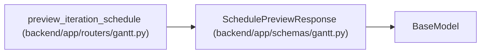

# SchedulePreviewResponse

**Location:** `backend/app/schemas/gantt.py:102`
**Kind:** Pydantic model
**Bases:** `BaseModel`
**Module:** [schemas_gantt](../modules/schemas_gantt.md)

## Description

Projected Gantt state after applying changes and rescheduling.

Produced by the real scheduler inside a rolled-back transaction; nothing
is persisted.

## Attributes

| Name | Type | Wire name | Required | Nullable | Default | Constraints | Examples | Description |
|------|------|-----------|----------|----------|---------|-------------|-------------|----------|
| `tasks` | `list[GanttTask]` | `tasks` | Yes | No | — | — | — | — |
| `overdue_task_ids` | `list[int]` | `overdue_task_ids` | No | No | `[]` | — | — | — |
| `schedule_result` | `Optional[ScheduleResult]` | `schedule_result` | No | Yes | `None` | — | — | — |

## Methods

*No public methods. Inherits from base classes.*

## Relationships

<!-- Auto-generated relationship summary. Do not edit by hand. -->

### Summary

| Module | Methods | Attributes |
|---|---:|---|
| [schemas_gantt](../modules/schemas_gantt.md) | 0 | `overdue_task_ids`, `schedule_result`, `tasks` |

### Structure

| Kind | Entity | Module |
|---|---|---|
| Base | `BaseModel` | — |

### References

| Reference | Kind | Source | Call sites |
|---|---|---|---:|
| `preview_iteration_schedule` | call | [routers_gantt](../modules/routers_gantt.md) | 1 |
| `preview_iteration_schedule` | type_reference | [routers_gantt](../modules/routers_gantt.md) | — |
