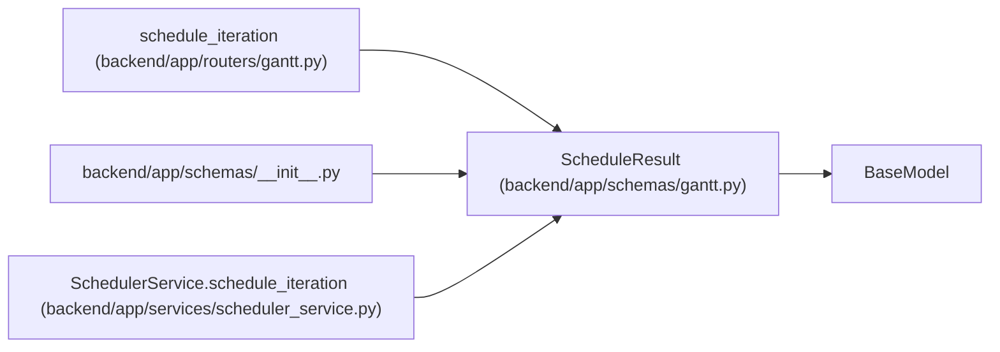

# ScheduleResult

**Location:** `backend/app/schemas/gantt.py:76`
**Kind:** Pydantic model
**Bases:** `BaseModel`
**Module:** [schemas_gantt](../modules/schemas_gantt.md)

## Description

Result of scheduling operation.

## Attributes

| Name | Type | Wire name | Required | Nullable | Default | Constraints | Examples | Description |
|------|------|-----------|----------|----------|---------|-------------|-------------|----------|
| `success` | `bool` | `success` | Yes | No | — | — | — | — |
| `decisions` | `list[SchedulingDecision]` | `decisions` | No | No | `[]` | — | — | — |
| `workload_balanced` | `bool` | `workload_balanced` | No | No | `True` | — | — | — |
| `workload_issues` | `list[WorkloadIssue]` | `workload_issues` | No | No | `[]` | — | — | — |

## Methods

*No public methods. Inherits from base classes.*

## Relationships

<!-- Auto-generated relationship summary. Do not edit by hand. -->

### Summary

| Module | Methods | Attributes |
|---|---:|---|
| [schemas_gantt](../modules/schemas_gantt.md) | 0 | `decisions`, `success`, `workload_balanced`, `workload_issues` |

### Structure

| Kind | Entity | Module |
|---|---|---|
| Base | `BaseModel` | — |

### References

| Reference | Kind | Source | Call sites |
|---|---|---|---:|
| `schedule_iteration` | type_reference | [routers_gantt](../modules/routers_gantt.md) | — |
| `__init__` | import | [schemas___init__](../modules/schemas___init__.md) | — |
| `SchedulerService.schedule_iteration` | call | [scheduler_service](../modules/scheduler_service.md) | 2 |
| `SchedulerService.schedule_iteration` | type_reference | [scheduler_service](../modules/scheduler_service.md) | — |
