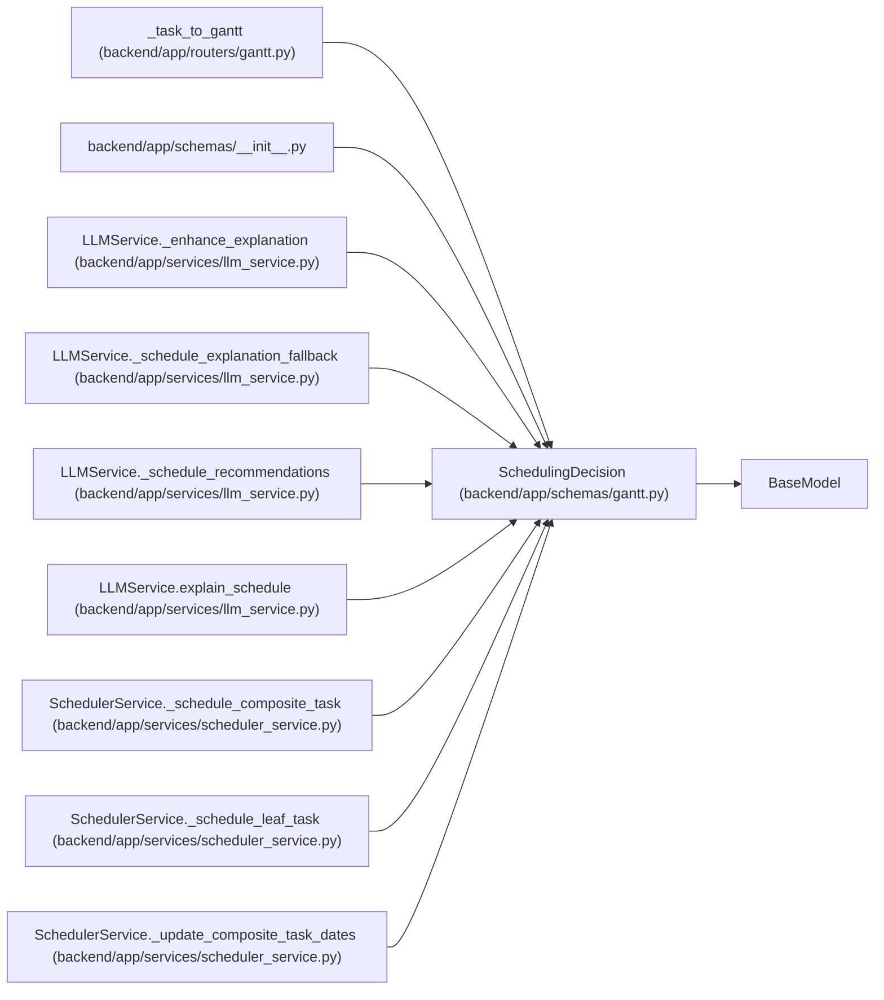

# SchedulingDecision

**Location:** `backend/app/schemas/gantt.py:58`
**Kind:** Pydantic model
**Bases:** `BaseModel`
**Module:** [schemas_gantt](../modules/schemas_gantt.md)

## Description

Explanation for a scheduling decision.

## Attributes

| Name | Type | Wire name | Required | Nullable | Default | Constraints | Examples | Description |
|------|------|-----------|----------|----------|---------|-------------|-------------|----------|
| `task_id` | `int` | `task_id` | Yes | No | — | — | — | — |
| `task_title` | `str` | `task_title` | Yes | No | — | — | — | — |
| `decision_type` | `Literal['scheduled', 'reordered', 'delayed', 'overdue']` | `decision_type` | Yes | No | — | — | — | — |
| `reason` | `str` | `reason` | Yes | No | — | — | — | — |
| `affected_tasks` | `list[int]` | `affected_tasks` | No | No | `[]` | — | — | — |

## Methods

*No public methods. Inherits from base classes.*

## Relationships

<!-- Auto-generated relationship summary. Do not edit by hand. -->

### Summary

| Module | Methods | Attributes |
|---|---:|---|
| [schemas_gantt](../modules/schemas_gantt.md) | 0 | `affected_tasks`, `decision_type`, `reason`, `task_id`, `task_title` |

### Structure

| Kind | Entity | Module |
|---|---|---|
| Base | `BaseModel` | — |

### References

| Reference | Kind | Source | Call sites |
|---|---|---|---:|
| `_task_to_gantt` | type_reference | [routers_gantt](../modules/routers_gantt.md) | — |
| `__init__` | import | [schemas___init__](../modules/schemas___init__.md) | — |
| `LLMService._enhance_explanation` | type_reference | [llm_service](../modules/llm_service.md) | — |
| `LLMService._schedule_explanation_fallback` | type_reference | [llm_service](../modules/llm_service.md) | — |
| `LLMService._schedule_recommendations` | type_reference | [llm_service](../modules/llm_service.md) | — |
| `LLMService.explain_schedule` | type_reference | [llm_service](../modules/llm_service.md) | — |
| `SchedulerService._schedule_composite_task` | call | [scheduler_service](../modules/scheduler_service.md) | 1 |
| `SchedulerService._schedule_composite_task` | type_reference | [scheduler_service](../modules/scheduler_service.md) | — |
| `SchedulerService._schedule_leaf_task` | call | [scheduler_service](../modules/scheduler_service.md) | 1 |
| `SchedulerService._schedule_leaf_task` | type_reference | [scheduler_service](../modules/scheduler_service.md) | — |
| `SchedulerService._update_composite_task_dates` | call | [scheduler_service](../modules/scheduler_service.md) | 1 |
| `SchedulerService._update_composite_task_dates` | type_reference | [scheduler_service](../modules/scheduler_service.md) | — |
