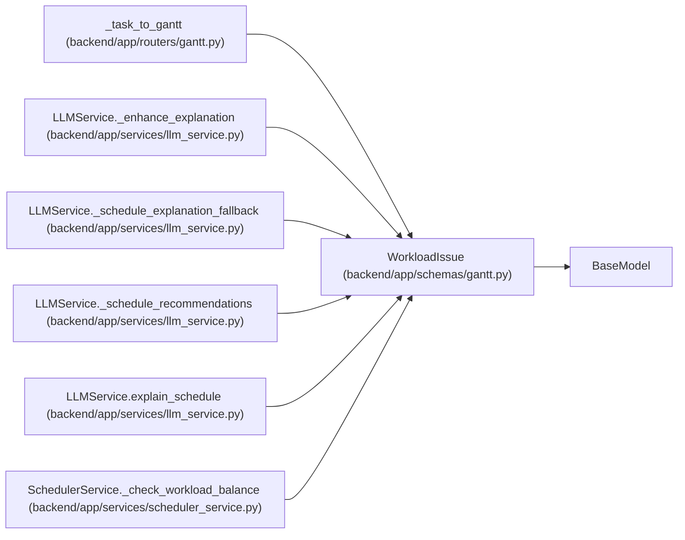

# WorkloadIssue

**Location:** `backend/app/schemas/gantt.py:69`
**Kind:** Pydantic model
**Bases:** `BaseModel`
**Module:** [schemas_gantt](../modules/schemas_gantt.md)

## Description

Workload issue for a team member.

## Attributes

| Name | Type | Wire name | Required | Nullable | Default | Constraints | Examples | Description |
|------|------|-----------|----------|----------|---------|-------------|-------------|----------|
| `member_id` | `int` | `member_id` | Yes | No | — | — | — | — |
| `member_name` | `str` | `member_name` | Yes | No | — | — | — | — |
| `issue` | `str` | `issue` | Yes | No | — | — | — | — |

## Methods

*No public methods. Inherits from base classes.*

## Relationships

<!-- Auto-generated relationship summary. Do not edit by hand. -->

### Summary

| Module | Methods | Attributes |
|---|---:|---|
| [schemas_gantt](../modules/schemas_gantt.md) | 0 | `issue`, `member_id`, `member_name` |

### Structure

| Kind | Entity | Module |
|---|---|---|
| Base | `BaseModel` | — |

### References

| Reference | Kind | Source | Call sites |
|---|---|---|---:|
| `_task_to_gantt` | type_reference | [routers_gantt](../modules/routers_gantt.md) | — |
| `LLMService._enhance_explanation` | type_reference | [llm_service](../modules/llm_service.md) | — |
| `LLMService._schedule_explanation_fallback` | type_reference | [llm_service](../modules/llm_service.md) | — |
| `LLMService._schedule_recommendations` | type_reference | [llm_service](../modules/llm_service.md) | — |
| `LLMService.explain_schedule` | type_reference | [llm_service](../modules/llm_service.md) | — |
| `SchedulerService._check_workload_balance` | call | [scheduler_service](../modules/scheduler_service.md) | 1 |
| `SchedulerService._check_workload_balance` | type_reference | [scheduler_service](../modules/scheduler_service.md) | — |
