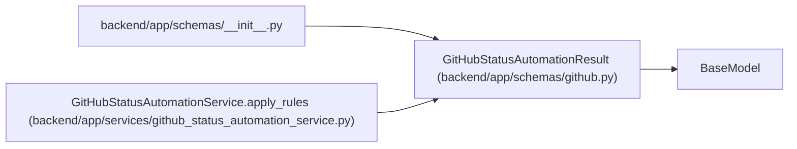

# GitHubStatusAutomationResult

**Location:** `backend/app/schemas/github.py:61`
**Kind:** Pydantic model
**Bases:** `BaseModel`
**Module:** [schemas_github](../modules/schemas_github.md)

## Description

Result of applying one GitHub status automation rule.

## Attributes

| Name | Type | Wire name | Required | Nullable | Default | Constraints | Examples | Description |
|------|------|-----------|----------|----------|---------|-------------|-------------|----------|
| `rule_id` | `int` | `rule_id` | Yes | No | — | — | — | — |
| `outcome` | `GitHubAutomationOutcome` | `outcome` | Yes | No | — | — | — | — |
| `from_status` | `str` | `from_status` | Yes | No | — | — | — | — |
| `target_status` | `str` | `target_status` | Yes | No | — | — | — | — |
| `reason` | `Optional[str]` | `reason` | No | Yes | `None` | — | — | — |
| `error` | `Optional[str]` | `error` | No | Yes | `None` | — | — | — |

## Methods

*No public methods. Inherits from base classes.*

## Relationships

<!-- Auto-generated relationship summary. Do not edit by hand. -->

### Summary

| Module | Methods | Attributes |
|---|---:|---|
| [schemas_github](../modules/schemas_github.md) | 0 | `error`, `from_status`, `outcome`, `reason`, `rule_id`, `target_status` |

### Structure

| Kind | Entity | Module |
|---|---|---|
| Base | `BaseModel` | — |

### References

| Reference | Kind | Source | Call sites |
|---|---|---|---:|
| `__init__` | import | [schemas___init__](../modules/schemas___init__.md) | — |
| `GitHubStatusAutomationService.apply_rules` | call | [github_status_automation_service](../modules/github_status_automation_service.md) | 7 |
| `GitHubStatusAutomationService.apply_rules` | type_reference | [github_status_automation_service](../modules/github_status_automation_service.md) | — |
