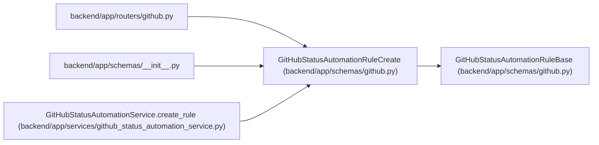

# GitHubStatusAutomationRuleCreate

**Location:** `backend/app/schemas/github.py:33`
**Kind:** Pydantic model
**Bases:** `GitHubStatusAutomationRuleBase`
**Module:** [schemas_github](../modules/schemas_github.md)

## Description

Create a GitHub status automation rule.

## Attributes

*No annotated attributes found.*

## Methods

*No public methods. Inherits from base classes.*

## Relationships

<!-- Auto-generated relationship summary. Do not edit by hand. -->

### Summary

| Module | Methods | Attributes |
|---|---:|---|
| [schemas_github](../modules/schemas_github.md) | 0 | — |

### Structure

| Kind | Entity | Module |
|---|---|---|
| Base | `GitHubStatusAutomationRuleBase` | [schemas_github](../modules/schemas_github.md) |

### References

| Reference | Kind | Source | Call sites |
|---|---|---|---:|
| `github` | import | [routers_github](../modules/routers_github.md) | — |
| `__init__` | import | [schemas___init__](../modules/schemas___init__.md) | — |
| `GitHubStatusAutomationService.create_rule` | type_reference | [github_status_automation_service](../modules/github_status_automation_service.md) | — |
