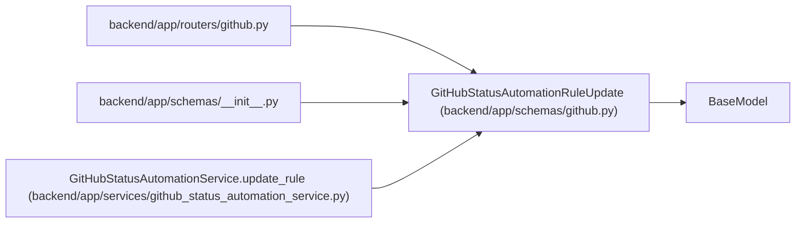

# GitHubStatusAutomationRuleUpdate

**Location:** `backend/app/schemas/github.py:37`
**Kind:** Pydantic model
**Bases:** `BaseModel`
**Module:** [schemas_github](../modules/schemas_github.md)

## Description

Update a GitHub status automation rule.

## Attributes

| Name | Type | Wire name | Required | Nullable | Default | Constraints | Examples | Description |
|------|------|-----------|----------|----------|---------|-------------|-------------|----------|
| `name` | `Optional[str]` | `name` | No | Yes | `None` | max_length=255; min_length=1 | — | — |
| `description` | `Optional[str]` | `description` | No | Yes | `None` | — | — | — |
| `enabled` | `Optional[bool]` | `enabled` | No | Yes | `None` | — | — | — |
| `github_event_type` | `Optional[GitHubAutomationEventType]` | `github_event_type` | No | Yes | `None` | — | — | — |
| `from_status` | `Optional[GitHubAutomationFromStatus]` | `from_status` | No | Yes | `None` | — | — | — |
| `target_status` | `Optional[GitHubAutomationTargetStatus]` | `target_status` | No | Yes | `None` | — | — | — |
| `reason_template` | `Optional[str]` | `reason_template` | No | Yes | `None` | — | — | — |
| `sort_order` | `Optional[int]` | `sort_order` | No | Yes | `None` | — | — | — |

## Methods

*No public methods. Inherits from base classes.*

## Relationships

<!-- Auto-generated relationship summary. Do not edit by hand. -->

### Summary

| Module | Methods | Attributes |
|---|---:|---|
| [schemas_github](../modules/schemas_github.md) | 0 | `description`, `enabled`, `from_status`, `github_event_type`, `name`, `reason_template`, `sort_order`, `target_status` |

### Structure

| Kind | Entity | Module |
|---|---|---|
| Base | `BaseModel` | — |

### References

| Reference | Kind | Source | Call sites |
|---|---|---|---:|
| `github` | import | [routers_github](../modules/routers_github.md) | — |
| `__init__` | import | [schemas___init__](../modules/schemas___init__.md) | — |
| `GitHubStatusAutomationService.update_rule` | type_reference | [github_status_automation_service](../modules/github_status_automation_service.md) | — |
