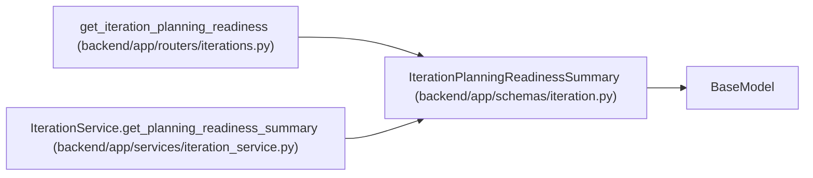

# IterationPlanningReadinessSummary

**Location:** `backend/app/schemas/iteration.py:109`
**Kind:** Pydantic model
**Bases:** `BaseModel`
**Module:** [schemas_iteration](../modules/schemas_iteration.md)

## Description

Compact planning inputs used by persistent navigation.

## Attributes

| Name | Type | Wire name | Required | Nullable | Default | Constraints | Examples | Description |
|------|------|-----------|----------|----------|---------|-------------|-------------|----------|
| `iteration_id` | `int` | `iteration_id` | Yes | No | — | — | — | — |
| `team_member_count` | `int` | `team_member_count` | Yes | No | — | — | — | — |
| `team_capacity_hours` | `float` | `team_capacity_hours` | Yes | No | — | — | — | — |
| `team_members_no_capacity` | `int` | `team_members_no_capacity` | Yes | No | — | — | — | — |
| `task_count` | `int` | `task_count` | Yes | No | — | — | — | — |
| `tasks_without_assignee` | `int` | `tasks_without_assignee` | Yes | No | — | — | — | — |
| `tasks_without_effort` | `int` | `tasks_without_effort` | Yes | No | — | — | — | — |
| `has_schedule` | `bool` | `has_schedule` | Yes | No | — | — | — | — |
| `risk_count` | `int` | `risk_count` | Yes | No | — | — | — | — |

## Methods

*No public methods. Inherits from base classes.*

## Relationships

<!-- Auto-generated relationship summary. Do not edit by hand. -->

### Summary

| Module | Methods | Attributes |
|---|---:|---|
| [schemas_iteration](../modules/schemas_iteration.md) | 0 | `has_schedule`, `iteration_id`, `risk_count`, `task_count`, `tasks_without_assignee`, `tasks_without_effort`, `team_capacity_hours`, `team_member_count`, `team_members_no_capacity` |

### Structure

| Kind | Entity | Module |
|---|---|---|
| Base | `BaseModel` | — |

### References

| Reference | Kind | Source | Call sites |
|---|---|---|---:|
| `get_iteration_planning_readiness` | type_reference | [iterations](../modules/iterations.md) | — |
| `IterationService.get_planning_readiness_summary` | call | [iteration_service](../modules/iteration_service.md) | 1 |
| `IterationService.get_planning_readiness_summary` | type_reference | [iteration_service](../modules/iteration_service.md) | — |
