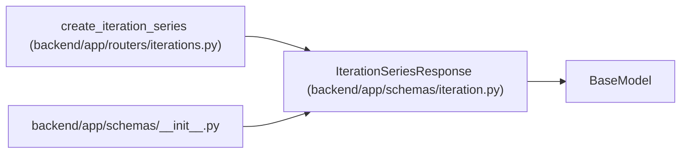

# IterationSeriesResponse

**Location:** `backend/app/schemas/iteration.py:82`
**Kind:** Pydantic model
**Bases:** `BaseModel`
**Module:** [schemas_iteration](../modules/schemas_iteration.md)

## Description

Response returned after creating an iteration series.

## Attributes

| Name | Type | Wire name | Required | Nullable | Default | Constraints | Examples | Description |
|------|------|-----------|----------|----------|---------|-------------|-------------|----------|
| `iterations` | `list[IterationResponse]` | `iterations` | Yes | No | — | — | — | — |

## Methods

*No public methods. Inherits from base classes.*

## Relationships

<!-- Auto-generated relationship summary. Do not edit by hand. -->

### Summary

| Module | Methods | Attributes |
|---|---:|---|
| [schemas_iteration](../modules/schemas_iteration.md) | 0 | `iterations` |

### Structure

| Kind | Entity | Module |
|---|---|---|
| Base | `BaseModel` | — |

### References

| Reference | Kind | Source | Call sites |
|---|---|---|---:|
| `create_iteration_series` | call | [iterations](../modules/iterations.md) | 1 |
| `create_iteration_series` | type_reference | [iterations](../modules/iterations.md) | — |
| `__init__` | import | [schemas___init__](../modules/schemas___init__.md) | — |
