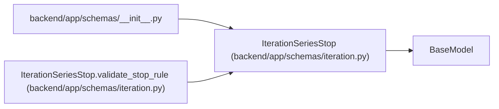

# IterationSeriesStop

**Location:** `backend/app/schemas/iteration.py:32`
**Kind:** Pydantic model
**Bases:** `BaseModel`
**Module:** [schemas_iteration](../modules/schemas_iteration.md)

## Description

Stop rule for generating a back-to-back iteration series.

## Validators

| Method | Scope | Fields | Mode | Options |
|--------|-------|--------|------|---------|
| `validate_stop_rule` | model | — | after | — |

## Attributes

| Name | Type | Wire name | Required | Nullable | Default | Constraints | Examples | Description |
|------|------|-----------|----------|----------|---------|-------------|-------------|----------|
| `mode` | `Literal['count', 'until_date']` | `mode` | Yes | No | — | — | — | — |
| `count` | `Optional[int]` | `count` | No | Yes | `None` | ge=1; le=100 | — | — |
| `until_date` | `Optional[date]` | `until_date` | No | Yes | `None` | — | — | — |

## Methods

| Method | Signature | Decorators | Description |
|--------|-----------|------------|-------------|
| `validate_stop_rule` | `() -> 'IterationSeriesStop'` | `@model_validator(mode='after')` | Ensure the stop rule carries the field required by its mode. |

## Relationships

<!-- Auto-generated relationship summary. Do not edit by hand. -->

### Summary

| Module | Methods | Attributes |
|---|---:|---|
| [schemas_iteration](../modules/schemas_iteration.md) | 1 | `count`, `mode`, `until_date` |

### Structure

| Kind | Entity | Module |
|---|---|---|
| Base | `BaseModel` | — |

### References

| Reference | Kind | Source | Call sites |
|---|---|---|---:|
| `__init__` | import | [schemas___init__](../modules/schemas___init__.md) | — |
| `IterationSeriesStop.validate_stop_rule` | type_reference | [schemas_iteration](../modules/schemas_iteration.md) | — |
