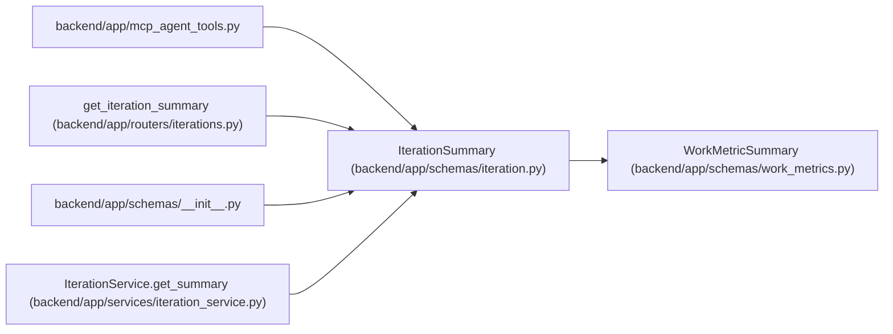

# IterationSummary

**Location:** `backend/app/schemas/iteration.py:93`
**Kind:** Pydantic model
**Bases:** `WorkMetricSummary`
**Module:** [schemas_iteration](../modules/schemas_iteration.md)

## Description

Summary statistics for an iteration.

## Attributes

| Name | Type | Wire name | Required | Nullable | Default | Constraints | Examples | Description |
|------|------|-----------|----------|----------|---------|-------------|-------------|----------|
| `id` | `int` | `id` | Yes | No | — | — | — | — |
| `name` | `str` | `name` | Yes | No | — | — | — | — |
| `project_id` | `Optional[int]` | `project_id` | No | Yes | `None` | — | — | — |
| `project` | `Optional[IterationProjectSummary]` | `project` | No | Yes | `None` | — | — | — |
| `start_date` | `date` | `start_date` | Yes | No | — | — | — | — |
| `end_date` | `date` | `end_date` | Yes | No | — | — | — | — |
| `working_days` | `int` | `working_days` | Yes | No | — | — | — | — |
| `total_tasks` | `int` | `total_tasks` | Yes | No | — | — | — | — |
| `completed_tasks` | `int` | `completed_tasks` | Yes | No | — | — | — | — |
| `total_effort_days` | `float` | `total_effort_days` | Yes | No | — | — | — | — |
| `team_capacity_days` | `float` | `team_capacity_days` | Yes | No | — | — | — | — |
| `overdue_tasks_count` | `int` | `overdue_tasks_count` | Yes | No | — | — | — | — |

## Methods

*No public methods. Inherits from base classes.*

## Relationships

<!-- Auto-generated relationship summary. Do not edit by hand. -->

### Summary

| Module | Methods | Attributes |
|---|---:|---|
| [schemas_iteration](../modules/schemas_iteration.md) | 0 | `completed_tasks`, `end_date`, `id`, `name`, `overdue_tasks_count`, `project`, `project_id`, `start_date`, `team_capacity_days`, `total_effort_days`, `total_tasks`, `working_days` |

### Structure

| Kind | Entity | Module |
|---|---|---|
| Base | `WorkMetricSummary` | [schemas_work_metrics](../modules/schemas_work_metrics.md) |

### References

| Reference | Kind | Source | Call sites |
|---|---|---|---:|
| `mcp_agent_tools` | import | [mcp_agent_tools](../modules/mcp_agent_tools.md) | — |
| `get_iteration_summary` | type_reference | [iterations](../modules/iterations.md) | — |
| `__init__` | import | [schemas___init__](../modules/schemas___init__.md) | — |
| `IterationService.get_summary` | call | [iteration_service](../modules/iteration_service.md) | 1 |
| `IterationService.get_summary` | type_reference | [iteration_service](../modules/iteration_service.md) | — |
