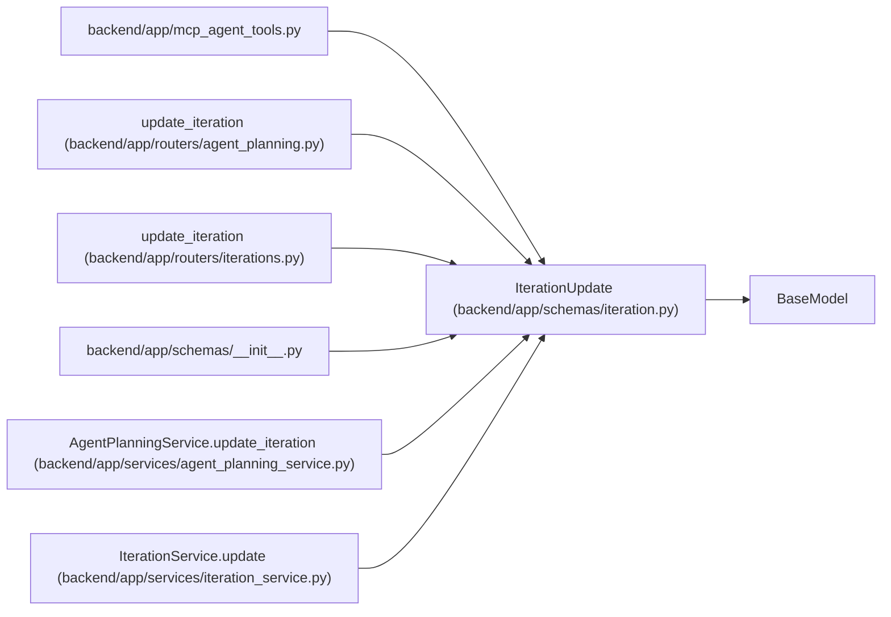

# IterationUpdate

**Location:** `backend/app/schemas/iteration.py:18`
**Kind:** Pydantic model
**Bases:** `BaseModel`
**Module:** [schemas_iteration](../modules/schemas_iteration.md)

## Description

Schema for updating an iteration.

## Attributes

| Name | Type | Wire name | Required | Nullable | Default | Constraints | Examples | Description |
|------|------|-----------|----------|----------|---------|-------------|-------------|----------|
| `name` | `Optional[str]` | `name` | No | Yes | `None` | min_length=1; max_length=255 | — | — |
| `calendar_id` | `Optional[int]` | `calendar_id` | No | Yes | `None` | — | — | — |
| `project_id` | `Optional[int]` | `project_id` | No | Yes | `None` | — | — | — |
| `start_date` | `Optional[date]` | `start_date` | No | Yes | `None` | — | — | — |
| `end_date` | `Optional[date]` | `end_date` | No | Yes | `None` | — | — | — |
| `manager_email` | `Optional[str]` | `manager_email` | No | Yes | `None` | max_length=255 | — | — |

## Methods

*No public methods. Inherits from base classes.*

## Relationships

<!-- Auto-generated relationship summary. Do not edit by hand. -->

### Summary

| Module | Methods | Attributes |
|---|---:|---|
| [schemas_iteration](../modules/schemas_iteration.md) | 0 | `calendar_id`, `end_date`, `manager_email`, `name`, `project_id`, `start_date` |

### Structure

| Kind | Entity | Module |
|---|---|---|
| Base | `BaseModel` | — |

### References

| Reference | Kind | Source | Call sites |
|---|---|---|---:|
| `mcp_agent_tools` | import | [mcp_agent_tools](../modules/mcp_agent_tools.md) | — |
| `update_iteration` | type_reference | [routers_agent_planning](../modules/routers_agent_planning.md) | — |
| `update_iteration` | type_reference | [iterations](../modules/iterations.md) | — |
| `__init__` | import | [schemas___init__](../modules/schemas___init__.md) | — |
| `AgentPlanningService.update_iteration` | type_reference | [agent_planning_service](../modules/agent_planning_service.md) | — |
| `IterationService.update` | type_reference | [iteration_service](../modules/iteration_service.md) | — |
