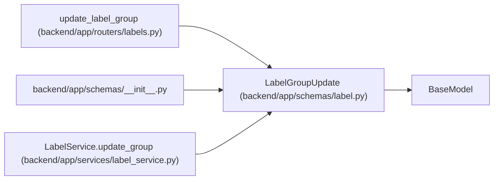

# LabelGroupUpdate

**Location:** `backend/app/schemas/label.py:25`
**Kind:** Pydantic model
**Bases:** `BaseModel`
**Module:** [schemas_label](../modules/schemas_label.md)

## Description

Schema for updating a governed label group.

## Model Configuration

| Setting | Value | Source |
|---------|-------|--------|
| `extra` | `'forbid'` | model_config |

## Attributes

| Name | Type | Wire name | Required | Nullable | Default | Constraints | Examples | Description |
|------|------|-----------|----------|----------|---------|-------------|-------------|----------|
| `key` | `Optional[str]` | `key` | No | Yes | `None` | max_length=100; min_length=1; pattern=unknown (GROUP_KEY_PATTERN) | — | — |
| `name` | `Optional[str]` | `name` | No | Yes | `None` | max_length=255; min_length=1 | — | — |
| `description` | `Optional[str]` | `description` | No | Yes | `None` | — | — | — |
| `color` | `Optional[str]` | `color` | No | Yes | `None` | pattern=unknown (HEX_COLOR_PATTERN) | — | — |
| `is_active` | `Optional[bool]` | `is_active` | No | Yes | `None` | — | — | — |
| `sort_order` | `Optional[int]` | `sort_order` | No | Yes | `None` | — | — | — |

## Methods

*No public methods. Inherits from base classes.*

## Relationships

<!-- Auto-generated relationship summary. Do not edit by hand. -->

### Summary

| Module | Methods | Attributes |
|---|---:|---|
| [schemas_label](../modules/schemas_label.md) | 0 | `color`, `description`, `is_active`, `key`, `name`, `sort_order` |

### Structure

| Kind | Entity | Module |
|---|---|---|
| Base | `BaseModel` | — |

### References

| Reference | Kind | Source | Call sites |
|---|---|---|---:|
| `update_label_group` | type_reference | [labels](../modules/labels.md) | — |
| `__init__` | import | [schemas___init__](../modules/schemas___init__.md) | — |
| `LabelService.update_group` | type_reference | [label_service](../modules/label_service.md) | — |
