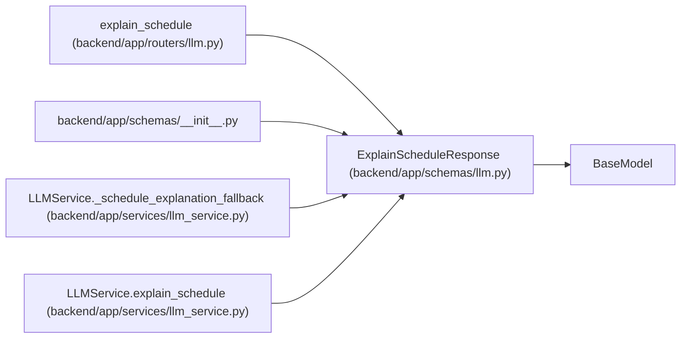

# ExplainScheduleResponse

**Location:** `backend/app/schemas/llm.py:118`
**Kind:** Pydantic model
**Bases:** `BaseModel`
**Module:** [schemas_llm](../modules/schemas_llm.md)

## Description

Response with schedule explanation.

## Attributes

| Name | Type | Wire name | Required | Nullable | Default | Constraints | Examples | Description |
|------|------|-----------|----------|----------|---------|-------------|-------------|----------|
| `summary` | `str` | `summary` | Yes | No | — | — | — | — |
| `decisions` | `list[ScheduleDecisionExplanation]` | `decisions` | No | No | factory: `list` | — | — | — |
| `workload_analysis` | `WorkloadAnalysis` | `workload_analysis` | Yes | No | — | — | — | — |
| `provider` | `Optional[str]` | `provider` | No | Yes | `None` | — | — | — |
| `model` | `Optional[str]` | `model` | No | Yes | `None` | — | — | — |
| `language` | `str` | `language` | No | No | `'en'` | — | — | — |
| `is_fallback` | `bool` | `is_fallback` | No | No | `False` | — | — | — |
| `finish_reason` | `Optional[str]` | `finish_reason` | No | Yes | `None` | — | — | — |
| `is_truncated` | `bool` | `is_truncated` | No | No | `False` | — | — | — |
| `warnings` | `list[str]` | `warnings` | No | No | factory: `list` | — | — | — |

## Methods

*No public methods. Inherits from base classes.*

## Relationships

<!-- Auto-generated relationship summary. Do not edit by hand. -->

### Summary

| Module | Methods | Attributes |
|---|---:|---|
| [schemas_llm](../modules/schemas_llm.md) | 0 | `decisions`, `finish_reason`, `is_fallback`, `is_truncated`, `language`, `model`, `provider`, `summary`, `warnings`, `workload_analysis` |

### Structure

| Kind | Entity | Module |
|---|---|---|
| Base | `BaseModel` | — |

### References

| Reference | Kind | Source | Call sites |
|---|---|---|---:|
| `explain_schedule` | type_reference | [routers_llm](../modules/routers_llm.md) | — |
| `__init__` | import | [schemas___init__](../modules/schemas___init__.md) | — |
| `LLMService._schedule_explanation_fallback` | call | [llm_service](../modules/llm_service.md) | 1 |
| `LLMService._schedule_explanation_fallback` | type_reference | [llm_service](../modules/llm_service.md) | — |
| `LLMService.explain_schedule` | type_reference | [llm_service](../modules/llm_service.md) | — |
