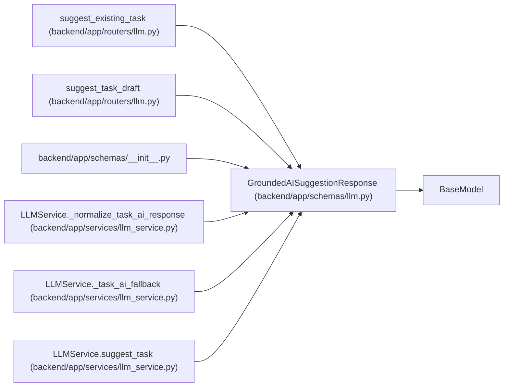

# GroundedAISuggestionResponse

**Location:** `backend/app/schemas/llm.py:53`
**Kind:** Pydantic model
**Bases:** `BaseModel`
**Module:** [schemas_llm](../modules/schemas_llm.md)

## Description

Advisory AI task draft separated into grounded and suggested parts.

## Attributes

| Name | Type | Wire name | Required | Nullable | Default | Constraints | Examples | Description |
|------|------|-----------|----------|----------|---------|-------------|-------------|----------|
| `provider` | `Optional[str]` | `provider` | No | Yes | `None` | — | — | — |
| `model` | `Optional[str]` | `model` | No | Yes | `None` | — | — | — |
| `language` | `str` | `language` | No | No | `'en'` | — | — | — |
| `is_fallback` | `bool` | `is_fallback` | No | No | `False` | — | — | — |
| `finish_reason` | `Optional[str]` | `finish_reason` | No | Yes | `None` | — | — | — |
| `is_truncated` | `bool` | `is_truncated` | No | No | `False` | — | — | — |
| `suggested_title` | `Optional[str]` | `suggested_title` | No | Yes | `None` | — | — | — |
| `suggested_description` | `str` | `suggested_description` | No | No | `''` | — | — | — |
| `acceptance_criteria` | `list[str]` | `acceptance_criteria` | No | No | factory: `list` | — | — | — |
| `implementation_notes` | `list[str]` | `implementation_notes` | No | No | factory: `list` | — | — | — |
| `risks` | `list[str]` | `risks` | No | No | factory: `list` | — | — | — |
| `open_questions` | `list[str]` | `open_questions` | No | No | factory: `list` | — | — | — |
| `grounded_facts` | `list[GroundedFact]` | `grounded_facts` | No | No | factory: `list` | — | — | — |
| `ungrounded_suggestions` | `list[str]` | `ungrounded_suggestions` | No | No | factory: `list` | — | — | — |
| `warnings` | `list[str]` | `warnings` | No | No | factory: `list` | — | — | — |

## Methods

*No public methods. Inherits from base classes.*

## Relationships

<!-- Auto-generated relationship summary. Do not edit by hand. -->

### Summary

| Module | Methods | Attributes |
|---|---:|---|
| [schemas_llm](../modules/schemas_llm.md) | 0 | `acceptance_criteria`, `finish_reason`, `grounded_facts`, `implementation_notes`, `is_fallback`, `is_truncated`, `language`, `model`, `open_questions`, `provider`, `risks`, `suggested_description` |

### Structure

| Kind | Entity | Module |
|---|---|---|
| Base | `BaseModel` | — |

### References

| Reference | Kind | Source | Call sites |
|---|---|---|---:|
| `suggest_existing_task` | type_reference | [routers_llm](../modules/routers_llm.md) | — |
| `suggest_task_draft` | type_reference | [routers_llm](../modules/routers_llm.md) | — |
| `__init__` | import | [schemas___init__](../modules/schemas___init__.md) | — |
| `LLMService._normalize_task_ai_response` | call | [llm_service](../modules/llm_service.md) | 1 |
| `LLMService._normalize_task_ai_response` | type_reference | [llm_service](../modules/llm_service.md) | — |
| `LLMService._task_ai_fallback` | call | [llm_service](../modules/llm_service.md) | 1 |
| `LLMService._task_ai_fallback` | type_reference | [llm_service](../modules/llm_service.md) | — |
| `LLMService.suggest_task` | type_reference | [llm_service](../modules/llm_service.md) | — |
