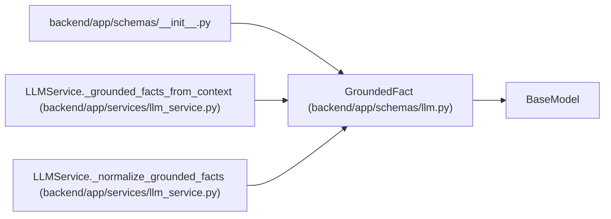

# GroundedFact

**Location:** `backend/app/schemas/llm.py:46`
**Kind:** Pydantic model
**Bases:** `BaseModel`
**Module:** [schemas_llm](../modules/schemas_llm.md)

## Description

Fact or claim tied to an explicit source in the AI context pack.

## Attributes

| Name | Type | Wire name | Required | Nullable | Default | Constraints | Examples | Description |
|------|------|-----------|----------|----------|---------|-------------|-------------|----------|
| `claim` | `str` | `claim` | Yes | No | — | min_length=1 | — | — |
| `source` | `str` | `source` | Yes | No | — | min_length=1 | — | — |

## Methods

*No public methods. Inherits from base classes.*

## Relationships

<!-- Auto-generated relationship summary. Do not edit by hand. -->

### Summary

| Module | Methods | Attributes |
|---|---:|---|
| [schemas_llm](../modules/schemas_llm.md) | 0 | `claim`, `source` |

### Structure

| Kind | Entity | Module |
|---|---|---|
| Base | `BaseModel` | — |

### References

| Reference | Kind | Source | Call sites |
|---|---|---|---:|
| `__init__` | import | [schemas___init__](../modules/schemas___init__.md) | — |
| `LLMService._grounded_facts_from_context` | call | [llm_service](../modules/llm_service.md) | 4 |
| `LLMService._grounded_facts_from_context` | type_reference | [llm_service](../modules/llm_service.md) | — |
| `LLMService._normalize_grounded_facts` | call | [llm_service](../modules/llm_service.md) | 1 |
| `LLMService._normalize_grounded_facts` | type_reference | [llm_service](../modules/llm_service.md) | — |
