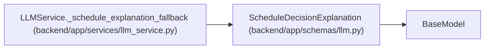

# ScheduleDecisionExplanation

**Location:** `backend/app/schemas/llm.py:108`
**Kind:** Pydantic model
**Bases:** `BaseModel`
**Module:** [schemas_llm](../modules/schemas_llm.md)

## Description

Human-readable explanation for a scheduling decision.

## Attributes

| Name | Type | Wire name | Required | Nullable | Default | Constraints | Examples | Description |
|------|------|-----------|----------|----------|---------|-------------|-------------|----------|
| `task_id` | `int` | `task_id` | Yes | No | — | — | — | — |
| `task_title` | `str` | `task_title` | Yes | No | — | — | — | — |
| `decision_type` | `str` | `decision_type` | Yes | No | — | — | — | — |
| `explanation` | `str` | `explanation` | Yes | No | — | — | — | — |

## Methods

*No public methods. Inherits from base classes.*

## Relationships

<!-- Auto-generated relationship summary. Do not edit by hand. -->

### Summary

| Module | Methods | Attributes |
|---|---:|---|
| [schemas_llm](../modules/schemas_llm.md) | 0 | `decision_type`, `explanation`, `task_id`, `task_title` |

### Structure

| Kind | Entity | Module |
|---|---|---|
| Base | `BaseModel` | — |

### References

| Reference | Kind | Source | Call sites |
|---|---|---|---:|
| `LLMService._schedule_explanation_fallback` | call | [llm_service](../modules/llm_service.md) | 1 |
