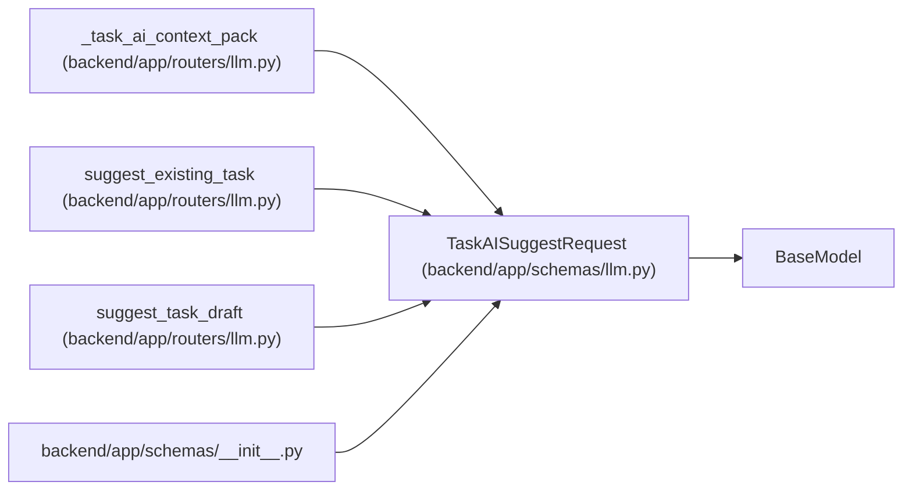

# TaskAISuggestRequest

**Location:** `backend/app/schemas/llm.py:73`
**Kind:** Pydantic model
**Bases:** `BaseModel`
**Module:** [schemas_llm](../modules/schemas_llm.md)

## Description

Request for grounded advisory task AI suggestions.

## Attributes

| Name | Type | Wire name | Required | Nullable | Default | Constraints | Examples | Description |
|------|------|-----------|----------|----------|---------|-------------|-------------|----------|
| `title` | `str` | `title` | No | No | `''` | max_length=500 | — | — |
| `description` | `Optional[str]` | `description` | No | Yes | `None` | — | — | — |
| `priority` | `Optional[int]` | `priority` | No | Yes | `None` | ge=1; le=10 | — | — |
| `effort_days` | `Optional[float]` | `effort_days` | No | Yes | `None` | ge=0 | — | — |
| `effort_hours` | `Optional[float]` | `effort_hours` | No | Yes | `None` | ge=0 | — | — |
| `assignee_id` | `Optional[int]` | `assignee_id` | No | Yes | `None` | — | — | — |
| `project_id` | `Optional[int]` | `project_id` | No | Yes | `None` | — | — | — |
| `milestone_id` | `Optional[int]` | `milestone_id` | No | Yes | `None` | — | — | — |
| `parent_id` | `Optional[int]` | `parent_id` | No | Yes | `None` | — | — | — |
| `depends_on` | `list[int]` | `depends_on` | No | No | factory: `list` | — | — | — |
| `tags` | `list[str]` | `tags` | No | No | factory: `list` | — | — | — |
| `is_optional` | `Optional[bool]` | `is_optional` | No | Yes | `None` | — | — | — |
| `is_deferred` | `Optional[bool]` | `is_deferred` | No | Yes | `None` | — | — | — |
| `min_start_date` | `Optional[str]` | `min_start_date` | No | Yes | `None` | — | — | — |
| `max_end_date` | `Optional[str]` | `max_end_date` | No | Yes | `None` | — | — | — |
| `source` | `Optional[str]` | `source` | No | Yes | `None` | — | — | — |
| `source_url` | `Optional[str]` | `source_url` | No | Yes | `None` | — | — | — |
| `external_key` | `Optional[str]` | `external_key` | No | Yes | `None` | — | — | — |
| `template_id` | `Optional[int]` | `template_id` | No | Yes | `None` | — | — | — |
| `user_context` | `Optional[str]` | `user_context` | No | Yes | `None` | — | — | — |
| `extra_context` | `dict[str, Any]` | `extra_context` | No | No | factory: `dict` | — | — | — |

## Methods

*No public methods. Inherits from base classes.*

## Relationships

<!-- Auto-generated relationship summary. Do not edit by hand. -->

### Summary

| Module | Methods | Attributes |
|---|---:|---|
| [schemas_llm](../modules/schemas_llm.md) | 0 | `assignee_id`, `depends_on`, `description`, `effort_days`, `effort_hours`, `external_key`, `extra_context`, `is_deferred`, `is_optional`, `max_end_date`, `milestone_id`, `min_start_date` |

### Structure

| Kind | Entity | Module |
|---|---|---|
| Base | `BaseModel` | — |

### References

| Reference | Kind | Source | Call sites |
|---|---|---|---:|
| `_task_ai_context_pack` | type_reference | [routers_llm](../modules/routers_llm.md) | — |
| `suggest_existing_task` | type_reference | [routers_llm](../modules/routers_llm.md) | — |
| `suggest_task_draft` | type_reference | [routers_llm](../modules/routers_llm.md) | — |
| `__init__` | import | [schemas___init__](../modules/schemas___init__.md) | — |
