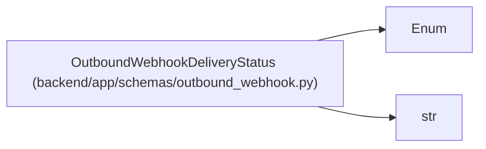

# OutboundWebhookDeliveryStatus

**Location:** `backend/app/schemas/outbound_webhook.py:54`
**Kind:** Enum
**Bases:** `str`, `Enum`
**Module:** [schemas_outbound_webhook](../modules/schemas_outbound_webhook.md)

## Description

Delivery states exposed by the outbound webhook API.

## Attributes

| Name | Declared value | Description |
|------|-------|-------------|
| `PENDING` | `'pending'` | — |
| `DELIVERED` | `'delivered'` | — |
| `FAILED` | `'failed'` | — |

## Methods

*No public methods. Inherits from base classes.*

## Relationships

<!-- Auto-generated relationship summary. Do not edit by hand. -->

### Summary

| Module | Methods | Attributes |
|---|---:|---|
| [schemas_outbound_webhook](../modules/schemas_outbound_webhook.md) | 0 | `DELIVERED`, `FAILED`, `PENDING` |

### Structure

| Kind | Entity | Module |
|---|---|---|
| Base | `Enum` | — |
| Base | `str` | — |
