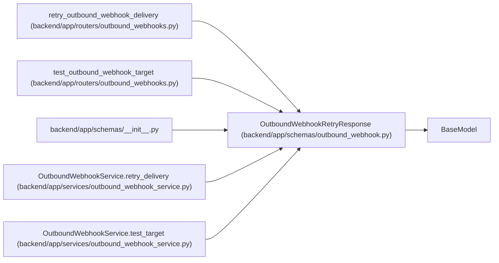

# OutboundWebhookRetryResponse

**Location:** `backend/app/schemas/outbound_webhook.py:191`
**Kind:** Pydantic model
**Bases:** `BaseModel`
**Module:** [schemas_outbound_webhook](../modules/schemas_outbound_webhook.md)

## Description

Response returned by retry and test delivery endpoints.

## Attributes

| Name | Type | Wire name | Required | Nullable | Default | Constraints | Examples | Description |
|------|------|-----------|----------|----------|---------|-------------|-------------|----------|
| `delivery` | `OutboundWebhookDeliveryResponse` | `delivery` | Yes | No | — | — | — | — |

## Methods

*No public methods. Inherits from base classes.*

## Relationships

<!-- Auto-generated relationship summary. Do not edit by hand. -->

### Summary

| Module | Methods | Attributes |
|---|---:|---|
| [schemas_outbound_webhook](../modules/schemas_outbound_webhook.md) | 0 | `delivery` |

### Structure

| Kind | Entity | Module |
|---|---|---|
| Base | `BaseModel` | — |

### References

| Reference | Kind | Source | Call sites |
|---|---|---|---:|
| `retry_outbound_webhook_delivery` | type_reference | [outbound_webhooks](../modules/outbound_webhooks.md) | — |
| `test_outbound_webhook_target` | type_reference | [outbound_webhooks](../modules/outbound_webhooks.md) | — |
| `__init__` | import | [schemas___init__](../modules/schemas___init__.md) | — |
| `OutboundWebhookService.retry_delivery` | call | [outbound_webhook_service](../modules/outbound_webhook_service.md) | 1 |
| `OutboundWebhookService.retry_delivery` | type_reference | [outbound_webhook_service](../modules/outbound_webhook_service.md) | — |
| `OutboundWebhookService.test_target` | call | [outbound_webhook_service](../modules/outbound_webhook_service.md) | 1 |
| `OutboundWebhookService.test_target` | type_reference | [outbound_webhook_service](../modules/outbound_webhook_service.md) | — |
