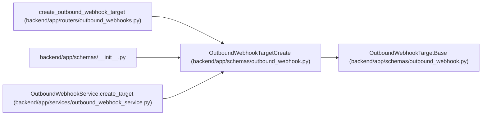

# OutboundWebhookTargetCreate

**Location:** `backend/app/schemas/outbound_webhook.py:96`
**Kind:** Pydantic model
**Bases:** `OutboundWebhookTargetBase`
**Module:** [schemas_outbound_webhook](../modules/schemas_outbound_webhook.md)

## Description

Create an outbound webhook target.

## Attributes

*No annotated attributes found.*

## Methods

*No public methods. Inherits from base classes.*

## Relationships

<!-- Auto-generated relationship summary. Do not edit by hand. -->

### Summary

| Module | Methods | Attributes |
|---|---:|---|
| [schemas_outbound_webhook](../modules/schemas_outbound_webhook.md) | 0 | — |

### Structure

| Kind | Entity | Module |
|---|---|---|
| Base | `OutboundWebhookTargetBase` | [schemas_outbound_webhook](../modules/schemas_outbound_webhook.md) |

### References

| Reference | Kind | Source | Call sites |
|---|---|---|---:|
| `create_outbound_webhook_target` | type_reference | [outbound_webhooks](../modules/outbound_webhooks.md) | — |
| `__init__` | import | [schemas___init__](../modules/schemas___init__.md) | — |
| `OutboundWebhookService.create_target` | type_reference | [outbound_webhook_service](../modules/outbound_webhook_service.md) | — |
