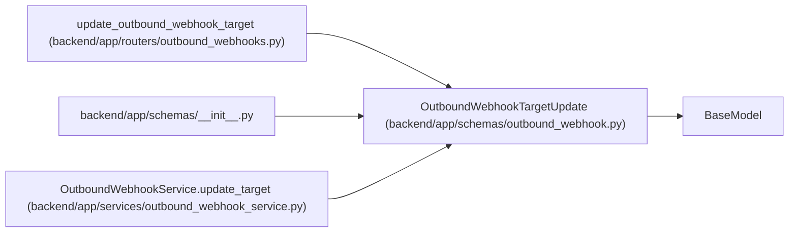

# OutboundWebhookTargetUpdate

**Location:** `backend/app/schemas/outbound_webhook.py:100`
**Kind:** Pydantic model
**Bases:** `BaseModel`
**Module:** [schemas_outbound_webhook](../modules/schemas_outbound_webhook.md)

## Description

Partial update for an outbound webhook target.

## Model Configuration

| Setting | Value | Source |
|---------|-------|--------|
| `extra` | `'forbid'` | model_config |

## Validators

| Method | Scope | Fields | Mode | Options |
|--------|-------|--------|------|---------|
| `validate_url` | field | url | after | — |
| `validate_events` | field | subscribed_events_json | after | — |
| `validate_headers` | field | headers_json | after | — |
| `validate_secret` | field | secret | after | — |

## Attributes

| Name | Type | Wire name | Required | Nullable | Default | Constraints | Examples | Description |
|------|------|-----------|----------|----------|---------|-------------|-------------|----------|
| `name` | `Optional[str]` | `name` | No | Yes | `None` | min_length=1; max_length=255 | — | — |
| `description` | `Optional[str]` | `description` | No | Yes | `None` | — | — | — |
| `url` | `Optional[str]` | `url` | No | Yes | `None` | min_length=1; max_length=1000 | — | — |
| `enabled` | `Optional[bool]` | `enabled` | No | Yes | `None` | — | — | — |
| `subscribed_events_json` | `Optional[list[str]]` | `subscribed_events_json` | No | Yes | `None` | — | — | — |
| `secret` | `Optional[str]` | `secret` | No | Yes | `None` | max_length=500 | — | — |
| `headers_json` | `Optional[dict[str, str]]` | `headers_json` | No | Yes | `None` | — | — | — |

## Methods

| Method | Signature | Decorators | Description |
|--------|-----------|------------|-------------|
| `validate_url` | `(value: Optional[str]) -> Optional[str]` | `@field_validator('url')`, `@classmethod` | — |
| `validate_events` | `(value: Optional[list[str]]) -> Optional[list[str]]` | `@field_validator('subscribed_events_json')`, `@classmethod` | — |
| `validate_headers` | `(value: Optional[dict[str, Any]]) -> Optional[dict[str, str]]` | `@field_validator('headers_json')`, `@classmethod` | — |
| `validate_secret` | `(value: Optional[str]) -> Optional[str]` | `@field_validator('secret')`, `@classmethod` | — |

## Relationships

<!-- Auto-generated relationship summary. Do not edit by hand. -->

### Summary

| Module | Methods | Attributes |
|---|---:|---|
| [schemas_outbound_webhook](../modules/schemas_outbound_webhook.md) | 4 | `description`, `enabled`, `headers_json`, `name`, `secret`, `subscribed_events_json`, `url` |

### Structure

| Kind | Entity | Module |
|---|---|---|
| Base | `BaseModel` | — |

### References

| Reference | Kind | Source | Call sites |
|---|---|---|---:|
| `update_outbound_webhook_target` | type_reference | [outbound_webhooks](../modules/outbound_webhooks.md) | — |
| `__init__` | import | [schemas___init__](../modules/schemas___init__.md) | — |
| `OutboundWebhookService.update_target` | type_reference | [outbound_webhook_service](../modules/outbound_webhook_service.md) | — |
